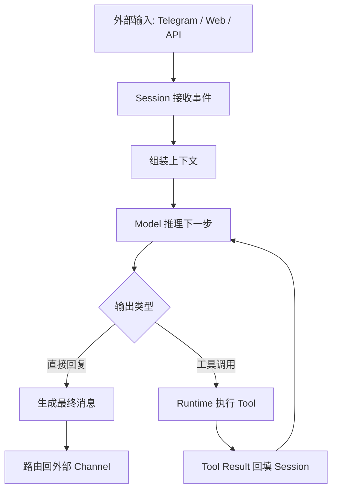
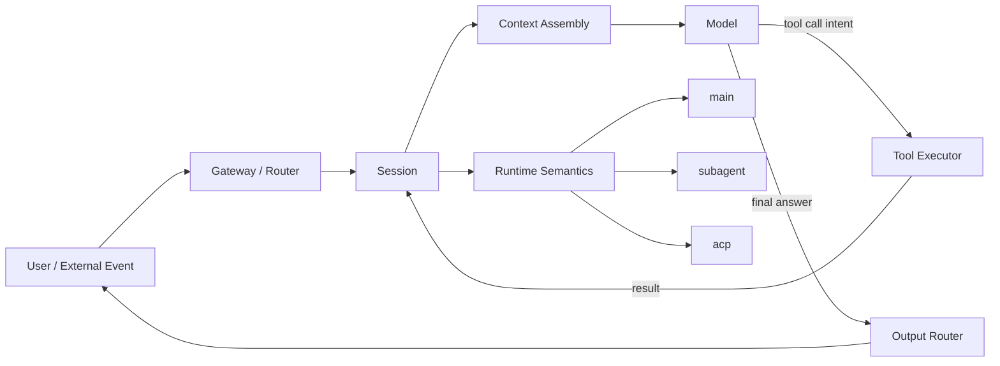

# 01 - Runtime、Session 与 Tool Call Stack

这一章开始讲 OpenClaw 更底层的一层：

> **一个用户请求，进入系统后，究竟落在哪个“运行骨架”里？**

答案不是“落在模型里”，而是：

> **落在一个 runtime 驱动的 session 中，由 session 持有上下文、组织工具调用、再把结果路由回外部世界。**

也就是说，模型很重要，但它不是 OpenClaw 的全部；真正把系统撑起来的，是 **runtime + session + tool execution loop**。

---

## 1. 先记一句最关键的话

> **OpenClaw 不只是“调用模型回复消息”，而是“让模型在一个可控 runtime 中，围绕 session 进行推理、调用工具、协调任务、输出结果”。**

这句话里有 4 个核心词：

- **模型（model）**：负责理解、推理、生成下一步动作
- **runtime**：负责承载 agent 的执行环境
- **session**：负责保存这串工作的状态与上下文
- **tool loop**：负责把“模型想做的动作”变成真实执行结果

---

## 2. 为什么说 session 是系统中枢？

很多人会下意识地把 agent 系统理解成：

1. 用户发来一条消息
2. 模型算一下
3. 回复发出去
4. 结束

但 OpenClaw 实际不是这么薄的一层。

更接近真实情况的是：

1. 外部世界送来一个事件（例如 Telegram 消息）
2. 系统把它路由到某个 agent session
3. session 组装上下文
4. 模型根据上下文决定：直接回答 / 调工具 / 拉记忆 / 生成文件 / 派生 subagent / 调 ACP harness
5. 工具结果回到 session
6. session 再决定是否继续下一步
7. 最终由 session 产出回复并路由回原 channel

所以 **session 不是聊天记录容器而已**，它更像：

- 这次工作的“状态机”
- 这次推理循环的“宿主”
- 工具调用结果的“汇合点”
- 对外消息回复的“出口”

### 一个好记的类比

如果把 OpenClaw 看成操作系统：

- **model** 像 CPU 上运行的推理核心
- **tool** 像系统调用或外部设备
- **session** 像一个正在运行的进程上下文
- **runtime** 像承载这个进程的执行环境

这个类比不完全等价，但非常有助于建立底层直觉。

---

## 3. runtime 到底是什么？

### 3.1 人话版定义

**runtime = 这个 agent 是“在哪种执行壳子里跑”的。**

它决定的不是回答内容本身，而是：

- 这个 agent 的上下文怎么管理
- 这个 agent 能用什么工具
- 子任务怎么创建
- 生命周期怎么维持
- 是否和外部 harness / thread / 持久会话绑定

### 3.2 为什么要有不同 runtime？

因为不同类型的 agent，并不是一种执行模型能全包。

例如：

- 主会话（main session）需要和真实聊天 surface 持续交互
- subagent 更像临时隔离工作单元
- ACP session 更像接入外部 coding harness 的专用执行壳

所以 OpenClaw 不是简单地“起更多 session”，而是允许：

> **在不同 runtime 里起不同类型的 session。**

### 3.3 你可以把 runtime 理解成“会话类型背后的执行语义”

同样都叫 session，但运行语义可能不同：

- `runtime=main`：主代理所在的核心交互上下文
- `runtime=subagent`：轻量隔离出来的子代理上下文
- `runtime=acp`：面向 ACP harness 的专用执行上下文

它们都叫 session，但不是一回事。

---

## 4. Tool Call Stack：为什么不是“模型直接干活”？

这是 OpenClaw 和普通聊天模型最大的结构差异之一。

模型本身并不能直接：

- 读你机器上的文件
- 修改本地仓库
- 执行 shell 命令
- 创建子会话
- 发送跨 session 消息

模型只能做一件事：

> **根据当前上下文，生成“下一步应该做什么”的结构化意图。**

而 OpenClaw runtime 做的是另一件事：

> **把这个结构化意图映射成真实工具调用，并把结果再送回模型。**

这就形成了一个循环：



这里最关键的是：

- **模型负责决策**
- **runtime 负责执行**
- **session 负责把两者串起来**

所以 OpenClaw 的“智能”，并不只来自模型本身，也来自它的执行回路设计。

---

## 5. 从分层角度拆一条请求

我们把一条消息真正拆一下。

### 第 1 层：输入事件层

外部平台来了一个事件：

- Telegram 私聊消息
- Discord 群聊消息
- Web UI 输入
- API 调用

这一层关心的不是“内容理解”，而是：

- 谁发来的？
- 来自哪个 surface？
- 是 direct chat 还是 group？
- reply / thread / attachment 元数据是什么？

### 第 2 层：session 路由层

系统拿到事件后，要决定：

- 把它送给哪个 session？
- 如果没有现成 session，是否新建？
- 这个 session 的 agent / model / channel 绑定是什么？

到了这一步，消息才真正进入“某个 agent 的工作上下文”。

### 第 3 层：上下文装配层

session 会把这一轮可见材料装起来，例如：

- 系统规则
- developer 指令
- 用户消息
- 项目上下文文件
- inbound metadata
- 必要的 memory 检索结果
- 最近几轮对话

这一步决定模型“看见了什么世界”。

### 第 4 层：推理与决策层

模型基于上下文选择动作：

- 直接答复
- 读文件
- 编辑文件
- 执行 shell
- 调用图片工具
- 启 subagent
- 发消息到别的 session

### 第 5 层：工具执行层

runtime 接过工具调用请求，真正执行：

- 校验参数是否合法
- 判断工具是否允许
- 必要时触发审批
- 执行具体动作
- 收集 stdout / 文件结果 / 媒体结果 / structured output

### 第 6 层：结果回填层

工具执行结果不会自动结束；它还要回到 session，成为新的上下文。

于是模型可能继续说：

- 再读一个文件
- 修一个 bug
- 提交 git
- 或者现在可以回复用户了

### 第 7 层：输出路由层

当 session 决定已经完成，就会把结果送回原始外部世界：

- Telegram 文本
- Discord 消息
- 带 `MEDIA:` 的附件发送
- 跨 session 消息
- 子任务完成通知

---

## 6. 为什么说 OpenClaw 更像任务执行系统？

如果它只是模型壳，那么流程会非常短：

> 输入 → 模型 → 输出

但 OpenClaw 实际更像：

> 输入事件 → session → 上下文装配 → 模型决策 → 工具执行 → 结果回填 → 再决策 → 输出路由

模型只是在中间一层。

真正把系统变成“能做事”的，是周围这些结构：

- session 持续化上下文
- tool system 打通执行能力
- memory system 提供跨会话连续性
- subagent / ACP 扩展执行形态
- channel router 把结果送回真实世界

所以更准确地说：

> **OpenClaw 是一个以 session 为中枢、以模型为决策器、以工具系统为执行臂的任务处理框架。**

---

## 7. Session 和“普通聊天历史”差在哪？

普通意义上的聊天历史：

- 只是消息列表
- 用来让模型“记得刚刚说了什么”

但 OpenClaw 的 session 至少还承担这些职责：

- 绑定当前 agent 配置
- 绑定可见工具集合
- 绑定运行时状态
- 绑定当前工作链路
- 记录工具调用与结果
- 决定消息发往哪里
- 决定是否可以生成子会话或跨会话通信

所以 session 是：

> **聊天上下文 + 执行上下文 + 路由上下文**

这三者合在一起，才是 OpenClaw 里的 session。

---

## 8. 一张图看懂 Runtime / Session / Tool



图里有两个关键点：

1. **Tool Result 是先回到 Session，不是直接回用户**
2. **Session 背后带着 Runtime 语义**，所以不同 session 的行为方式并不一样

---

## 9. 命令行/运维视角下怎么验证这套理解？

当你开始从工程视角看 OpenClaw，建议养成这个习惯：

### 先看系统当前状态

```bash
openclaw status
```

这通常是最先执行的总览命令。它帮助你确认：

- 当前服务是不是活着
- 当前节点/网关是否在线
- 有没有明显异常

### 再看 gateway 状态

```bash
openclaw gateway status
```

这是更偏服务侧的入口，用来确认 gateway daemon 本身是否正常。

必要时会配合：

```bash
openclaw gateway restart
```

但要注意：重启是动作，不是第一观察手段。先看状态，再决定是否动手。

### 再回到 agent/session 视角去理解现象

如果用户说“机器人没回我”，不要一上来就怪模型。

要分层想：

1. 是消息没进来？
2. 还是进来了但没路由到正确 session？
3. 还是 session 卡在工具调用？
4. 还是模型产出了动作但工具执行失败？
5. 还是其实已经产出结果，但输出路由没送出去？

这就是底层分层思维的价值。

---

## 10. 这一章你必须吃透的结论

如果只记 5 条，记这 5 条：

1. **模型不是 OpenClaw 的全部，session 才是执行中枢。**
2. **runtime 决定 session 属于哪种执行语义。**
3. **tool call 的本质是：模型做决策，runtime 代为执行。**
4. **工具结果会回填到 session，再继续下一轮推理。**
5. **OpenClaw 本质上更像任务执行系统，而不只是聊天壳。**

---

## 11. 下一章会接什么？

下一章最自然的衔接是：

> **Gateway、Node、Provider、Channel 到底分别位于哪一层？它们之间怎么连接？**

也就是把今天讲的“执行骨架”，继续往外扩到“系统分层与边界”。

如果这一章看懂了，后面你会对这些概念理解得特别稳：

- 为什么消息路由不是模型负责
- 为什么不同 tool 有不同权限与审批行为
- 为什么 ACP 不是“更强版 subagent”
- 为什么 memory 不是自动永久记忆
