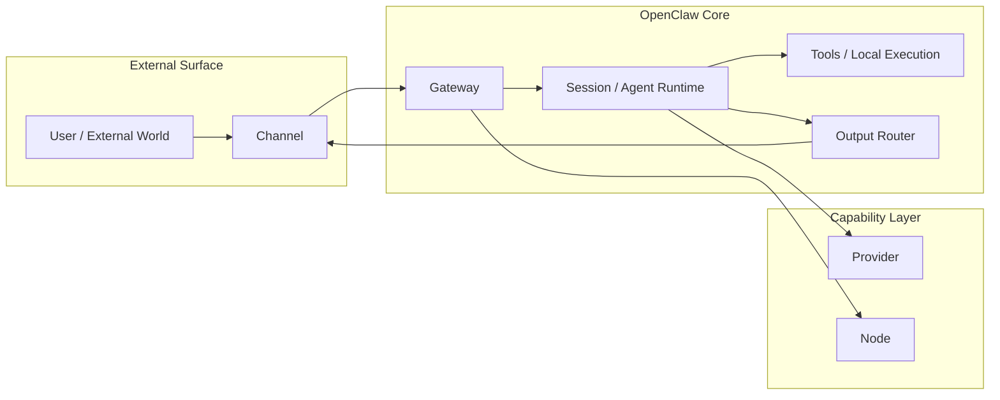

# 02 - Gateway、Node、Provider 与 Channel 分层

这一章我们把上一章的“执行骨架”继续往外扩。

上一章主要讲的是系统内部主轴：

- runtime
- session
- tool call loop

这一章要解决的是另一个很关键的问题：

> **OpenClaw 这个系统，对外到底是怎么接消息、怎么连模型、怎么连设备、怎么把结果送回去的？**

如果这一层没搞清楚，后面你在命令行里看到 `gateway`、`node`、`provider`、`channel` 这些词时，就会觉得像一团线。

---

## 1. 先给一句总纲

你可以先记这句：

> **Gateway 负责系统入口与服务协调，Channel 负责外部消息面，Provider 负责能力来源，Node 负责把某台机器挂进这个系统。**

这四个词不是一层东西。

它们分别站在系统不同位置：

- **Gateway**：系统服务层 / 路由协调层
- **Channel**：外部通信层
- **Provider**：模型或多模态能力接入层
- **Node**：分布式执行节点 / 设备接入层

---

## 2. 先看整张分层图



这张图要看懂两件事：

1. **用户不是直接连模型，而是先进入 channel，再进入 gateway**
2. **provider 和 node 都是“系统能力来源”的一部分，但方向完全不同**

---

## 3. Channel：外部通信面

### 3.1 Channel 是什么？

**Channel = OpenClaw 与外部世界交互的消息面。**

比如：

- Telegram
- Discord
- Web
- 其他接入面

Channel 这一层关心的是：

- 消息从哪里来
- 消息往哪里回
- reply / thread / media / sender / account 这些元数据怎么处理

### 3.2 Channel 不负责什么？

Channel **不负责**：

- 模型推理
- 业务决策
- session 内部状态管理
- 工具执行

它更像“进出口接口层”。

### 3.3 为什么这层对运维很重要？

因为很多“机器人没回复”的问题，其实是 **channel 输入/输出层异常**，不是模型问题。

比如：

- Telegram account 配错
- pairing 没完成
- 消息进来了但没正确映射到 session
- 回复生成了，但输出路由没送回 channel

所以排障时不能一上来就怪模型。

---

## 4. Gateway：系统入口与协调中枢

### 4.1 Gateway 是什么？

可以把 **gateway** 理解成 OpenClaw 的服务入口和协调枢纽。

它通常负责这些事情：

- 持有系统运行态
- 接收/协调外部事件
- 管理路由与系统服务能力
- 承接配置、节点、会话等核心系统状态

如果你上一章把 **session** 理解成“具体某次工作的中枢”，
那这一章可以这样记：

> **gateway 更像整个 OpenClaw 系统级别的入口服务。**

### 4.2 Gateway 和 Session 的区别

很多人一开始会混：

- gateway 像不像 session？
- 它们谁更核心？

其实不是同一层。

- **Gateway**：系统级入口与协调服务
- **Session**：某个 agent 工作流的上下文中枢

你可以这样理解：

- gateway 管“系统怎么运转”
- session 管“某个 agent 这次怎么干活”

### 4.3 命令行里怎么感知它？

最直接就是：

```bash
openclaw gateway status
```

还有：

```bash
openclaw gateway start
openclaw gateway stop
openclaw gateway restart
```

这些命令本身就说明：

> gateway 是一个明确可观察、可启停、可诊断的系统服务面。

这点非常运维。

---

## 5. Provider：能力来源层

### 5.1 Provider 是什么？

**Provider = OpenClaw 所连接的能力提供方。**

最常见的就是模型提供方，例如：

- OpenAI
- 其他兼容 provider
- 图像/视频/多模态生成提供方

换句话说：

> OpenClaw 自己不是大模型本体，它通过 provider 去接入模型和多模态能力。

### 5.2 Provider 负责什么？

Provider 主要提供：

- 文本模型能力
- 图像理解能力
- 图像生成能力
- 视频生成能力
- 其他兼容能力接口

### 5.3 Provider 和 Tool 的区别

这个特别容易混。

- **Provider**：给系统“智能能力”
- **Tool**：给系统“执行能力”

举例：

- 让模型回答问题，靠 provider
- 让 agent 读本地文件，靠 tool
- 让 agent 执行 shell，靠 tool
- 让 agent 做图像分析，通常还是走 provider-backed 能力

所以 provider 更像“脑力来源”，tool 更像“手脚来源”。

---

## 6. Node：把设备/机器挂进系统

### 6.1 Node 是什么？

**Node = 接入 OpenClaw 的某个运行节点 / 设备实例。**

它常见于这类场景：

- 手机作为 companion node
- 远端机器加入系统
- 某台设备向 gateway 报到
- 某个分布式执行位置被纳入统一管理

### 6.2 为什么需要 Node？

因为 OpenClaw 不一定只跑在“单机、单入口、单终端”的世界里。

现实里你可能会有：

- VPS 上的 gateway
- 手机上的 companion app
- 家里的另一台设备
- 不同位置的执行节点

这时系统需要一个抽象去表达：

> **这台设备/这台机器，已经是系统的一部分。**

这个抽象就是 node。

### 6.3 Node 和 Session 的区别

- **Node** 是设备/机器级别的接入单位
- **Session** 是 agent 工作上下文级别的执行单位

所以：

- 一台 node 上，可以承载多个 session
- session 不等于 node
- node 更接近“基础设施成员”
- session 更接近“逻辑工作单元”

这两个不要混。

---

## 7. 四者放在一起，怎么区分最稳？

用一句最稳的对照法：

- **Channel**：我和外部世界在哪说话？
- **Gateway**：整个系统由谁接、谁协调？
- **Provider**：智能能力从哪来？
- **Node**：哪台设备/机器属于这个系统？

如果你记住这四个问题，基本就不容易混。

---

## 8. 从一次真实请求再走一遍

假设现在有一条 Telegram 消息发给你：

### 第一步：消息先进入 Channel

Telegram 这层负责把外部消息送进系统，并带上：

- account
- sender
- chat type
- message id
- reply context

### 第二步：Gateway 接手协调

gateway 负责接住这个事件，并把它纳入系统内部处理流程。

### 第三步：进入 Session

系统把事件路由到目标 session，session 组装上下文并驱动 agent 开始工作。

### 第四步：需要智能能力时调用 Provider

如果要模型推理、图像分析或其他模型能力，就走 provider。

### 第五步：需要执行能力时调用 Tool

如果要读文件、执行命令、生成文件、调用其他内部能力，就走 tool。

### 第六步：结果再经由 Output Router 回到 Channel

最终回复不是直接“飞回 Telegram”，而是由系统输出层路由，再送回 channel。

这就是一条消息在分层世界里的移动方式。

---

## 9. 命令行 / 运维视角下怎么排查？

这一章最值钱的其实是排障思路。

如果你遇到“OpenClaw 不工作了”，可以先按层排：

### 先看 gateway

```bash
openclaw gateway status
```

如果 gateway 自己都不健康，后面的 session / channel / node 往往也不会正常。

### 再看系统总览

```bash
openclaw status
```

确认服务、节点、基础运行态有没有明显异常。

### 再问：这是 channel 问题、provider 问题、还是 session 问题？

排障可以按这个顺序想：

1. **消息有没有进系统？**
   - 如果没有，优先怀疑 channel / pairing / account / webhook / surface
2. **消息进系统后，有没有路由到正确 session？**
   - 如果没有，优先怀疑路由或会话绑定
3. **session 有动作，但能力调用失败了吗？**
   - 模型失败看 provider
   - 本地执行失败看 tool / host / permissions
4. **结果已经生成，但没发回去吗？**
   - 再回头看 channel/output routing

这个思维方式，才是运维视角真正该练的东西。

---

## 10. 最容易混淆的几个坑

### 坑 1：把 gateway 当成 session

错。gateway 是系统级入口服务，session 是 agent 工作上下文。

### 坑 2：把 provider 当成 tool

错。provider 提供模型/多模态能力，tool 提供执行能力。

### 坑 3：把 node 当成 session

错。node 是设备/机器接入单位，session 是逻辑执行单位。

### 坑 4：把 channel 当成业务逻辑层

错。channel 主要是通信面，不是主业务决策层。

---

## 11. 这一章你必须吃透的结论

只记 5 条的话，记这 5 条：

1. **Channel 是外部通信面，不是推理核心。**
2. **Gateway 是系统级入口与协调层。**
3. **Provider 是智能能力来源，不是执行器。**
4. **Node 是设备/机器级接入单位，不是 agent 会话。**
5. **排障时要按层定位：channel / gateway / session / provider / tool。**

---

## 12. 下一章会接什么？

下一章最自然的衔接是：

> **Subagent 与 ACP 到底在执行模型上差在哪？为什么它们不是简单的强弱关系？**

也就是把“系统分层”继续推进到“不同 runtime 的执行形态差异”。
