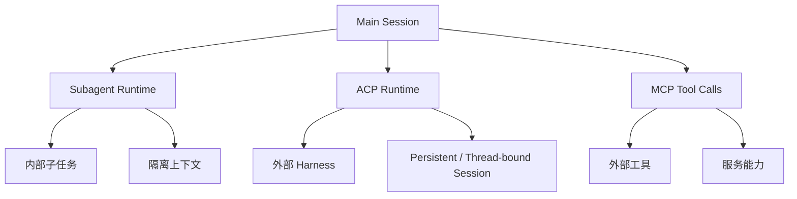

# 03 - Subagent 与 ACP 的执行模型

这一章讲 OpenClaw 里最容易混淆、但又最值得搞明白的一组概念：

- Subagent
- ACP

很多人第一次接触时会下意识地把它们理解成：

- 都是“再开一个 agent”
- ACP 是不是就是“更强版 subagent”
- 它们是不是只是参数不一样

但如果你从执行模型看，这种理解不够准确。

> **Subagent 和 ACP 看起来都像“开个新会话去做事”，但它们背后代表的是不同 runtime 语义。**

这章的重点不是记接口名字，而是要建立一个底层认识：

> **它们不是单纯强弱关系，而是不同类型的执行壳。**

---

## 1. 先记一句最关键的话

> **Subagent 更像 OpenClaw 内部派生出的隔离子工作单元；ACP 更像接入外部 agent harness 的专用执行通道。**

这句如果吃透了，后面很多细节都能自己推出来。

---

## 2. Subagent 是什么？

### 2.1 人话定义

**Subagent = 从当前主工作流里拆出去的一个子任务 agent。**

它的目的通常是：

- 隔离上下文
- 拆分复杂任务
- 并行或半独立推进某一部分工作
- 避免主 session 被某个分支问题污染得太重

你可以把它理解成：

> **主 agent 临时派出去干一件事的“分身”。**

### 2.2 它适合什么场景？

典型场景：

- 一个任务太复杂，想拆成子块
- 需要一个干净上下文去调查某个问题
- 想让另一个 agent 先跑一轮独立分析
- 需要短时隔离，而不是长期绑定外部环境

### 2.3 它的特点

Subagent 通常有这些味道：

- 更像系统内部派生物
- 通常任务导向很强
- 上下文是隔离的，但仍属于 OpenClaw 自己的工作体系
- 常见于一次任务中的临时拆分

---

## 3. ACP 是什么？

### 3.1 全称

ACP 常见展开是：

> **Agent Client Protocol**

你可以先把它理解成一种：

> **让 OpenClaw 去接入外部 agent runtime / coding harness 的协议化方式。**

### 3.2 人话定义

如果说 Subagent 是“系统内部再分一个 agent”，
那 ACP 更像：

> **把某个外部 agent 执行壳，以标准方式接进 OpenClaw。**

常见理解方式是：

- OpenClaw 不是直接自己假装那个外部 agent
- 而是通过 ACP runtime 去挂接一个外部 harness
- 让这个 harness 成为系统里可管理、可通信的一类 session

### 3.3 它适合什么场景？

典型场景：

- 用户明确说要“在 codex / claude code / cursor / gemini 里做”
- 需要 thread-bound persistent coding session
- 需要绑定特定 ACP agent / harness
- 不是只想临时拆任务，而是想进入某个外部 agent 工作环境

---

## 4. 两者共同点：为什么大家会混？

因为表面上它们确实很像。

两者都可能表现为：

- 新起一个 session
- 让另一个 agent 去做事
- 当前会话和新会话之间可以形成任务关系
- 最终结果再回到主流程

所以如果你只看表象，就会觉得：

> “不都是开个子会话吗？”

但真正关键的是：

> **虽然表面动作相似，但它们接入的是不同执行模型。**

---

## 5. 核心差异：定位不同

### Subagent 的定位

Subagent 的定位更偏：

- OpenClaw 内部任务拆分
- 内部执行隔离
- 内部子工作流

### ACP 的定位

ACP 的定位更偏：

- 外部 harness 接入
- 特定 agent runtime 接轨
- 持久或线程绑定的专用工作环境

一句话区分：

- **Subagent：内部拆任务**
- **ACP：外部接 runtime**

---

## 6. 核心差异：上下文边界不同

### Subagent 的上下文边界

Subagent 虽然隔离，但它天然还是 OpenClaw 内部体系的一部分。

也就是说：

- 它是从主工作流中派生出来的
- 它服务于主工作流
- 它是系统内部拆分的一种手段

### ACP 的上下文边界

ACP 更像“把另一种执行环境挂进来”。

所以它的边界感更像：

- OpenClaw 在调度它
- 但它背后可能对应的是外部 harness 的会话语义
- 它不是单纯为了临时拆任务才存在

这就是为什么 ACP 经常和 thread / persistent session / harness 绑定在一起。

---

## 7. 核心差异：生命周期不同

### Subagent 生命周期

Subagent 更常见的是：

- 为当前任务而生
- 任务结束后就完成使命
- 偏短期、偏工作单元

### ACP 生命周期

ACP 更常见的是：

- 可以绑定外部 agent session
- 可以是 thread-bound persistent session
- 更偏长期、偏环境型、偏工作台型

所以如果你问：

> “哪个更像一次性工人？哪个更像一个专门工位？”

答案通常是：

- **Subagent 更像一次性工人**
- **ACP 更像专门工位 / 专用工作台**

---

## 8. 核心差异：实现入口上的不同

这是最值得工程化理解的一段。

表面上看，二者都可能通过 `sessions_spawn` 发起。

但参数语义不一样。

### Subagent 常见方式

更偏：

- `runtime="subagent"`
- `mode="run"` 或 `mode="session"`
- 轻量上下文
- 为当前任务临时派生

### ACP 常见方式

更偏：

- `runtime="acp"`
- 往往需要明确 `agentId`
- 更容易和 `thread=true`、`mode="session"` 一起出现
- 绑定某个外部 ACP harness

也就是说：

> **二者不只是“参数值不同”，而是参数背后代表的执行语义不同。**

---

## 9. 为什么说 ACP 不是“更强版 Subagent”？

这是最重要的误区纠正。

很多人会下意识想：

- Subagent 是普通版
- ACP 是高级版

但这其实不对。

正确理解是：

- 不是“强弱关系”
- 而是“类型关系”

就像：

- Docker 容器不是“更强版进程”
- SSH 不是“更强版 shell”

它们解决的问题不一样。

同理：

- Subagent 解决的是 **内部任务拆分与隔离**
- ACP 解决的是 **外部 agent runtime / harness 接入**

这两个不是同一坐标轴。

---

## 10. ACP 和 MCP 也别混

这一章顺手再纠一下另一个常见混淆：ACP vs MCP。

### MCP 是什么？

MCP 更偏：

- 工具 / 服务接入协议
- 让 agent 能调用外部工具与服务

### ACP 是什么？

ACP 更偏：

- agent runtime / harness 接入协议
- 让 OpenClaw 能接入外部 agent 执行壳

所以：

- **MCP 连接的是工具能力**
- **ACP 连接的是 agent 执行环境**

这俩不是一层。

---

## 11. 一张图看懂 Subagent / ACP / MCP

图里要看懂：

- Subagent 是内部子任务分支
- ACP 是外部 runtime 接入分支
- MCP 是工具调用分支

三者都和“扩展能力”有关，但扩展方向完全不同。

---

## 12. 命令行/运维视角下怎么判断该用哪个？

你可以用一个非常实用的问题来判断：

### 问题 1：我只是想把当前任务拆出去吗？

如果是，优先想 **subagent**。

### 问题 2：我是不是明确要在某个外部 agent harness 里工作？

如果是，优先想 **ACP**。

### 问题 3：我只是想调用一个外部工具/服务吗？

如果是，优先想 **MCP**。

这个判断方式很稳。

---

## 13. 最容易混淆的几个坑

### 坑 1：以为 ACP = 高级 subagent

错。ACP 不是 subagent 升级包，而是另一类 runtime。

### 坑 2：以为只要是新 session 就都是 subagent

错。新 session 只是表象，关键看 runtime 语义。

### 坑 3：以为 ACP 和 MCP 差不多

错。一个偏 agent runtime，一个偏 tool/service access。

### 坑 4：把 thread-bound persistent session 也当成普通子任务

错。这通常更接近 ACP 工作模式，不是一次性 subagent 心智模型。

---

## 14. 这一章你必须吃透的结论

只记 5 条的话，记这 5 条：

1. **Subagent 主要解决内部任务拆分与上下文隔离。**
2. **ACP 主要解决外部 agent runtime / harness 接入。**
3. **它们不是强弱关系，而是类型关系。**
4. **两者都可能表现为新 session，但 runtime 语义不同。**
5. **MCP 连接工具，ACP 连接 agent 执行环境。**

---

## 15. 下一章会接什么？

下一章最自然的衔接是：

> **Memory 检索与上下文装配到底是怎么工作的？为什么 memory 不是“自动永久记忆”？**

也就是把执行模型继续推进到“上下文从哪里来、怎么被组装”的问题。
