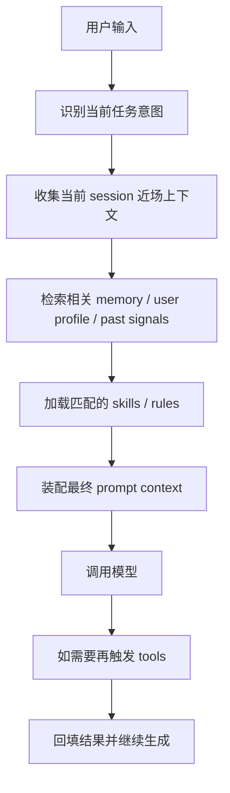

# 04 - Memory 检索与上下文装配

这一章开始讲一个非常容易被低估、但其实决定 agent 实际表现上限的部分：

- Memory retrieval
- Context assembly

很多人会把 memory 理解成：

- “模型有个长期记忆库”
- “记住用户说过的话，以后再拿出来”
- “有了 memory，就等于 agent 真的一直记得你”

这几个说法不算全错，但都太表层。

> **从运行时视角看，memory 不是‘模型脑子里一直记着’，而是一次请求开始时，对历史知识做检索、筛选、装配，再注入当前上下文。**

这句话如果吃透了，你后面看很多现象就会通：

- 为什么有时候 agent 明明“记得你”，有时候又像忘了
- 为什么 memory 不是越多越好
- 为什么 session history、memory、skills、system prompt 经常会一起影响输出
- 为什么很多问题不是“模型笨”，而是“上下文装配错了”

---

## 1. 先记一句最关键的话

> **Memory 的本质不是存储本身，而是“在当前请求里把什么历史信息重新变成可见上下文”。**

也就是说：

- 存下来，只是第一步
- 能不能在这一次请求里被召回，才是关键
- 被召回后怎么和 system prompt、session、skills 拼起来，决定了最终回答风格和质量

---

## 2. 为什么要把 Memory 和 Session 分开理解？

这是最基础但最重要的一层。

### 2.1 Session 是什么

Session 更像：

- 当前这条工作流的连续对话与操作轨迹
- 当前任务的近场上下文
- 当前 runtime 正在围绕它推进的主线程

它的特点通常是：

- 连续
- 强时序
- 与当前任务直接相关
- 越近越重要

### 2.2 Memory 是什么

Memory 更像：

- 跨 session 的可回收知识
- 用户偏好、长期约束、稳定事实
- 过去经验的压缩表示

它的特点通常是：

- 跨回合、跨会话
- 不一定按时间连续
- 是“历史沉淀”，不是“当前线程本身”

一句话区分：

- **Session = 当前现场**
- **Memory = 可被召回的历史知识**

---

## 3. 为什么说 Memory 不是“自动永远记得”？

因为模型每次生成时，真正能看到的只有：

- system prompt
- 当前消息
- 被保留/压缩后的 session 上下文
- 被检索出来并注入的 memory
- 被加载的 skills
- 工具结果

注意这里的关键点：

> **Memory 必须先被检索出来，再被装进当前上下文，模型才看得到。**

所以“已经存入 memory” ≠ “本轮一定生效”。

中间至少还要过三道关：

1. **能不能召回** —— 检索阶段有没有命中
2. **值不值得带进来** —— 装配阶段有没有被筛掉
3. **带进来后会不会被别的上下文压过去** —— 例如 system prompt、最近几轮对话、工具输出更强

这就是为什么你会看到一种现象：

- 某个偏好明明记住了
- 但某一轮还是没体现

这不一定是 memory 丢了，很多时候是：

- 没命中
- 命中了但没注入
- 注入了但权重不够

---

## 4. 一个请求里，Memory 大概处在什么位置？

把一次请求粗略拆开，你可以这样看：

这里最容易忽略的点是：

> **Memory 不是单独决定输出，而是在 context assembly 阶段参与“拼上下文”。**

所以你不能把它理解成一个独立脑区。
它更像一次请求前的“历史知识取用层”。

---

## 5. Context Assembly 到底在装什么？

“上下文装配”这个词听起来抽象，但其实很工程化。

它本质上是在回答：

> **这一次模型调用之前，到底该把哪些信息放进 prompt，按什么优先级摆进去？**

通常会参与装配的东西包括：

1. **System prompt / role 定义**
2. **当前用户消息**
3. **最近 session 历史**
4. **memory / user profile 检索结果**
5. **skills 规则与参考材料**
6. **工具调用结果**
7. **平台/环境信息**

所以最终回答，不是某一个来源单独决定的。
而是这些来源在一个有限上下文窗口里共同竞争后的结果。

这就是为什么：

- 有时是最近对话压过长期偏好
- 有时是 system prompt 压过用户当前措辞
- 有时是工具结果比 memory 更硬
- 有时是 skill 约束把回答风格拽回来了

---

## 6. 为什么 Memory 不是越多越好？

这是运维和系统设计里非常典型的问题。

表面看你会觉得：

- 多存点总没坏处
- 以后检索出来就行

但真实世界里，memory 过多会带来至少四类问题。

### 6.1 检索噪声变大

记的东西越杂，越容易在检索时把不重要但“像相关”的内容捞上来。

结果就是：

- 真正重要的信息被噪声稀释
- 模型看到了很多“半相关”内容
- 回答风格变得犹豫、分散、拖沓

### 6.2 优先级混乱

如果 memory 里既有稳定偏好，也有临时任务残留，系统就容易混淆：

- 哪些是长期有效事实
- 哪些只是上一轮临时状态

这会导致 agent 出现一种很烦的味道：

> **把一次性任务状态，当成长期人格或长期要求。**

### 6.3 上下文窗口被占用

memory 最后要变成 prompt 的一部分。

而 prompt 容量不是无限的。

你塞太多历史信息进去，就会挤压：

- 当前任务描述
- 最新对话
- 工具返回结果
- 推理空间

### 6.4 过拟合旧偏好

有时候用户当时那么说，只是当时的需要。

如果系统把这些旧表达长期固化，后面就会出现：

- 用户已经变了
- memory 还在按旧版本服务

所以好的 memory 系统，不只是“会记”，更重要的是：

- **记对**
- **召回对**
- **过时要淘汰**

---

## 7. 从工程视角看，Memory 检索通常在干什么？

你可以把 memory retrieval 理解成一个很轻量的检索系统。

它通常做的事包括：

- 根据当前输入判断主题
- 匹配相关历史偏好、事实、约束
- 可能区分 user profile 与普通 memory
- 返回少量最相关结果
- 交给上游做 context assembly

你不必先执着具体实现细节，但要先建立一个正确印象：

> **Memory retrieval 更像检索/召回层，不像持续挂在模型脑子里的常驻变量。**

如果把这个理解错，后面你很容易误判系统行为。

---

## 8. 运维视角：为什么很多“agent 记性不好”其实是装配问题？

这是非常实战的一段。

当你观察一个 agent 出现“像失忆”一样的表现时，不要一上来就说：

- memory 坏了
- 存储丢了
- 模型不行

更好的排查顺序通常是：

### 第一步：先看有没有存进去

问自己：

- 这个信息到底有没有进入 memory store？
- 是 user profile 还是普通 memory？
- 是结构化保存还是只是聊过？

### 第二步：再看有没有被检索出来

问自己：

- 这轮输入是否足够触发相关记忆召回？
- 检索 query 是否太弱？
- 命中结果是不是被其他更相似内容挤掉了？

### 第三步：看有没有被装进最终上下文

问自己：

- 即使命中了，最后有没有真正注入 prompt？
- 是否被上下文裁剪了？
- 是否因为 token 压力被压缩掉了？

### 第四步：看有没有被更强信号覆盖

问自己：

- system prompt 有没有更高优先级约束？
- 当前用户新要求是否覆盖旧偏好？
- 最新工具结果是否与旧 memory 冲突？

这个排查顺序很重要，因为它能帮你把问题从“玄学”拉回工程现实。

---

## 9. 一个很实用的心智模型

你可以把整个系统想成三层：

### 第一层：当前现场

- 当前用户输入
- 最近几轮对话
- 当前任务目标

### 第二层：历史补充

- user profile
- memory
- past-session retrieval

### 第三层：行为约束与能力补充

- system prompt
- skills
- tool results
- platform/runtime constraints

然后在一次真正生成之前，这三层会被拼到一起。

所以最终输出更像：

> **“当前现场 + 历史补充 + 行为约束” 的合成结果。**

如果你以后调 agent，脑子里一定要有这个三层图，不然很容易把责任全怪给某一层。

---

## 10. 这一章最该带走的三件事

### 第一件：Memory 不是常驻意识

它不是模型一直开着脑内记忆。

它更像：

- 有存储
- 有检索
- 有注入
- 有装配

### 第二件：Session 和 Memory 不是一回事

- Session 是当前线程
- Memory 是跨线程可回收知识

### 第三件：很多问题发生在 context assembly

真正影响质量的，往往不是“有没有信息”，而是：

- 哪些信息被带进来了
- 谁优先级更高
- 最终 prompt 长什么样

---

## 11. 用一句话收尾

> **Memory 决定系统能不能把过去带到现在；Context assembly 决定系统把过去带成什么样。**

前者解决“有没有历史可用”，
后者解决“这次生成到底看到什么”。

如果你把这两层分清楚，后面看 agent 的长期行为、稳定性、个性化、排障思路，都会清楚很多。

---

## 你学到这一步该会什么

看完这章，你至少应该能回答：

1. 为什么“memory 已存储”不等于“本轮一定生效”？
2. session 和 memory 的根本区别是什么？
3. context assembly 实际上在解决什么问题？
4. 如果 agent 看起来“忘了你”，排查顺序应该是什么？

---

## 一句话小结

**Memory 负责把历史找回来，context assembly 负责决定这次到底让模型看到哪些历史。**
