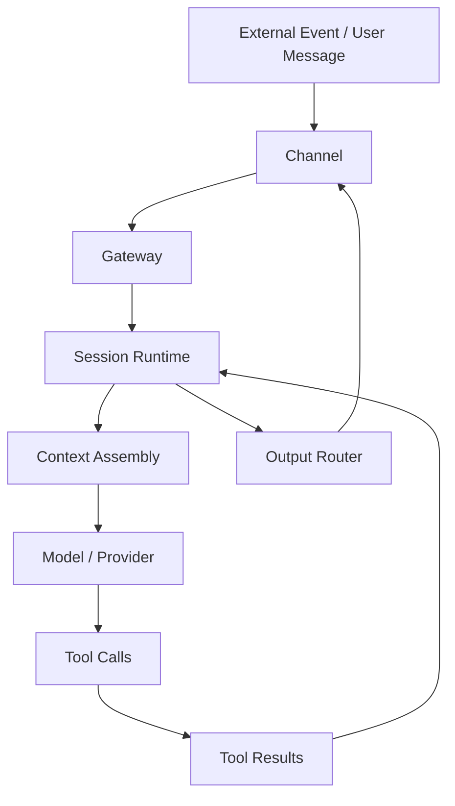

# 05 - OpenClaw 命令行与运维观察面

这一章开始把视角再往“运维”和“可观测性”推进一步。

前面几章我们已经建立了这些核心认识：

- OpenClaw 不是单次聊天回复，而是 runtime 驱动的 session 系统
- gateway / node / provider / channel 处在不同分层
- subagent 和 ACP 是不同的执行模型
- memory 不是“永远记得”，而是检索 + 装配进当前上下文

现在往下走，一个很实际的问题就来了：

> **如果我要像运维一样观察、验证、排查一个 OpenClaw 实例，我该看什么？从哪层下手？**

这一章讲的就是这个：

- 命令行入口
- 运行态观察面
- 诊断思路
- 从“它为什么没按预期工作”反推该查哪层

这章不是教你背命令大全，而是建立一个更关键的能力：

> **把 OpenClaw 当成一个可观测、可诊断、可分层排障的系统来看。**

---

## 1. 先记一句最关键的话

> **运维视角下，OpenClaw 不是“一个 AI 回复器”，而是一组可以被观察、验证、定位问题的服务层与执行层组合。**

也就是说，真正要观察的对象不是一句回复好不好，而是：

- 消息进来了吗
- session 接住了吗
- 上下文装配对了吗
- 模型走对 provider 了吗
- tool 调用成功了吗
- 输出有没有正确送回 channel

你一旦有了这个观察框架，很多“AI 怎么又抽风了”的问题，都会变成可拆解的系统问题。

---

## 2. 先建立一个运维观察总图

从排障角度，这张图不是讲“请求怎么流”，而是讲：

> **每一层都可能成为故障点。**

所以一个成熟的排障习惯不是：

- 先怪模型

而是：

- 先问故障落在哪一层

---

## 3. 命令行在这里到底扮演什么角色

对运维来说，命令行不是“高级玩法”，而是**观察面和控制面**。

你可以把 CLI 理解成至少四种用途：

### 3.1 控制面

比如：

- 启停 gateway
- 查看 session
- 管理 jobs
- 检查节点状态

这是“系统现在怎么运转”的控制接口。

### 3.2 观察面

比如：

- 看状态
- 看日志
- 看当前有哪些 session / process / runtime
- 查某个 job 是否在跑

这是“系统现在处于什么状态”的读接口。

### 3.3 验证面

比如：

- 我怀疑某个 provider 没配对，能不能直接验证
- 我怀疑 tool 调用失败，能不能直接看结果
- 我怀疑 gateway 没起来，能不能先查 service 状态

这是“我的猜测对不对”的验证接口。

### 3.4 运维入口

比如：

- 重启某层
- 修配置
- 补 credential
- 清理有问题的长期任务

这是“从诊断走向修复”的执行接口。

所以 CLI 不是可有可无，而是系统被工程化后的自然入口。

---

## 4. 你真正该观察的，不是一个点，而是四个面

如果要从工程角度把 OpenClaw 的观察面压缩，你可以先看四类：

### 4.1 入口面：消息有没有进系统

这一层通常关心：

- channel 配置对不对
- 外部消息是否送达
- gateway 是否收到了事件
- inbound metadata 是否正常

常见症状：

- 用户发了消息，但系统完全没反应
- 某个平台有消息，另一个平台正常
- 只有群里不响应，私聊正常

这种时候优先怀疑：

- channel
- gateway 输入路由
- 账号/配对/连接状态

而不是先怀疑模型。

---

### 4.2 执行面：session 有没有把任务接住

这一层通常关心：

- 是不是落到了正确 session
- session 有没有恢复到正确上下文
- runtime 类型是不是符合预期
- 子任务是否被正确拆分或调度

常见症状：

- 好像上下文丢了
- 回答接不上前文
- 该进 ACP 的任务进了普通主会话
- 该拆 subagent 的复杂任务全挤在主线程里

这种时候要看的是：

- session 绑定
- runtime 语义
- 会话恢复逻辑
- task routing

---

### 4.3 能力面：模型和工具有没有正常工作

这一层通常关心：

- provider 是否正常
- model 是否选对
- tool 是否可用
- toolset 权限是否足够
- 某次调用是否报错

常见症状：

- 会说，但不动手
- 能读文件，但不能跑命令
- 浏览器自动化总失败
- 调某个外部能力时报授权/连接错误

这时候要分清：

- 是模型问题
- 是 provider 问题
- 是 tool 缺失
- 是 tool 参数不对
- 是权限/审批边界拦住了

---

### 4.4 回传面：结果有没有正确送出去

这一层通常关心：

- 输出是否已经生成
- gateway 有没有拿到结果
- output router 是否正确路由
- channel 是否成功发回

常见症状：

- 系统内部看起来做完了，但用户没收到
- 文本正常，媒体发不出去
- 某个 channel 格式错乱
- 后台任务完成了，但没有通知

这种时候别只盯着“任务有没有做完”，还要看：

- 做完后的结果有没有进入 delivery path

---

## 5. 运维排障时最实用的第一原则：先定层，再定点

很多人排障失败，是因为一开始就盯着一个具体现象，然后在错误层里越钻越深。

比如：

- “为什么它没回复？”
- “为什么它忘了？”
- “为什么它不执行？”

这种问法太表层。

更好的问法是：

### 5.1 这是入口层问题吗？

- 事件有没有进来？
- channel / gateway 有没有问题？

### 5.2 这是上下文层问题吗？

- session 恢复错了吗？
- memory / skills / recent history 装配错了吗？

### 5.3 这是能力层问题吗？

- provider 出错了吗？
- tool 没开？没权限？参数错？

### 5.4 这是输出层问题吗？

- 内容生成了，但没投递成功？

所以一个非常有用的排障口诀是：

> **先问哪层坏了，再问这一层里哪个点坏了。**

---

## 6. 你应该怎么观察“像失忆”这种问题

“它又忘了”是最常见、也最容易误判的问题。

但运维视角下，这通常不是一个词能解释的故障。

它至少可能有四种来源：

### 6.1 session 近场上下文断了

例如：

- 会话没恢复到原线程
- 当前消息进了另一个 session
- 最近几轮上下文没有被保留

这时看起来像“失忆”，其实是**当前现场断了**。

### 6.2 memory 没有召回

例如：

- 相关偏好没命中
- 检索信号太弱
- past session 没搜到

这时像“失忆”，其实是**检索失败**。

### 6.3 memory 召回了，但没被装进关键位置

例如：

- 注入预算不够
- 被更强的 system/developer 指令压过去
- 最近对话比长期偏好更强

这时像“失忆”，其实是**context assembly 权重问题**。

### 6.4 记住了，但执行层没有遵守

例如：

- 偏好在 memory 里，但对应流程没进 skill
- 当前 prompt 没把关键要求写死
- tool/flow 约束没有被真正固化

这时像“失忆”，其实是**要求放错层**。

这也是为什么你前面讨论 memory 时，结论最后会落到：

> **很多‘记不住’其实不是存储故障，而是装配、优先级或分层设计故障。**

---

## 7. 你应该怎么观察“它不执行”这种问题

另一个非常典型的问题是：

> “它看起来懂，但就是不动手。”

这个现象至少要分三类：

### 7.1 根本没有那个 tool

例如：

- 没 terminal
- 没 browser
- 没 send_message
- 没 file tools

这时不是“不愿意做”，而是**做不了**。

### 7.2 有 tool，但当前上下文没有触发正确使用

例如：

- 技能没加载
- 当前指令让它偏向口头回答
- 缺少必要前置信息，导致没有走执行路径

这时不是能力缺失，而是**决策路径没命中**。

### 7.3 tool 调用了，但失败了

例如：

- 参数不合法
- 外部网页报错
- shell 失败
- 权限限制
- 后台进程没 ready

这时已经不是“有没有执行”，而是**执行失败且可能未充分恢复**。

所以你看到“它不执行”，真正该拆成三问：

1. 有没有这个能力？
2. 有没有走到这条能力路径？
3. 真调用后成功了吗？

---

## 8. 从运维角度，什么叫“健康的 OpenClaw 实例”

你可以把一个健康实例理解成：

### 8.1 入口健康

- 外部 channel 能稳定收发
- gateway 在运行
- 消息能被正确路由

### 8.2 会话健康

- session 恢复稳定
- runtime 语义一致
- 子任务与主任务边界清楚

### 8.3 能力健康

- provider 可用
- model 选择符合预期
- tools 可调用
- 长任务可被观察

### 8.4 结果健康

- 工具结果能回填
- 最终回复能送回原 surface
- 异常能留痕、能追查

你会发现，这其实已经很像普通分布式系统/自动化平台的健康标准了。

这也是为什么从运维视角理解 agent，会比从“聊天机器人”视角更稳。

---

## 9. 为什么“命令行与观察面”这一章很重要

因为一个系统只要进入真实使用，就一定会遇到：

- 某个 channel 抽风
- 某个 provider 超时
- 某个 tool 不可用
- 某个 session 恢复错位
- 某个 job 卡住
- 某次输出没有送达

如果你没有观察面，你只能凭感觉猜。

如果你有观察面，你就能：

- 看状态
- 看证据
- 分层定位
- 验证修复

所以真正的 agent 工程化，不是“会做很多炫酷事情”，而是：

> **出问题时，你能知道它为什么出问题、坏在哪层、怎么验证修好没有。**

---

## 10. 这一章你真正要抓住什么

如果只留五点，就是：

1. OpenClaw 是可观测系统，不只是回复器
2. CLI 是控制面 + 观察面 + 验证面 + 运维入口
3. 排障要先定层：入口 / 执行 / 能力 / 回传
4. “失忆”通常是 session、memory retrieval、context assembly 或分层设计的问题
5. “不执行”通常要拆成：没 tool、没走执行路径、调用失败

---

## 小结

把这一章压成一句话：

> **运维视角下，不要问“AI 为什么怪怪的”，而要问“故障落在哪一层，我该看哪条观察面”。**

这就是 OpenClaw 从“会用”走向“会维护”的分水岭。
