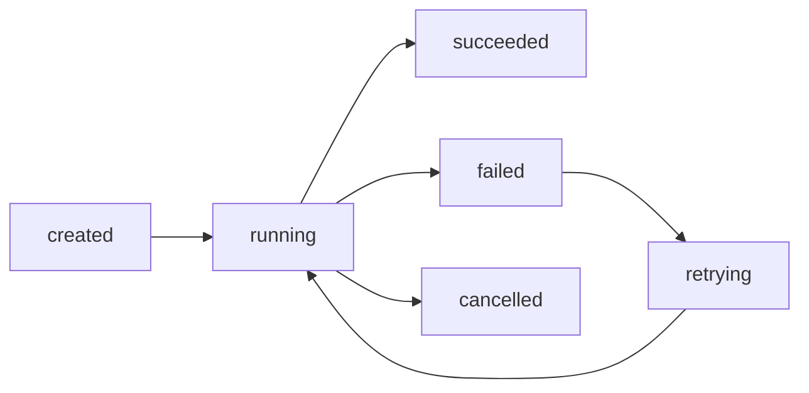

# 07 - 后台任务、detached work 与持久化执行

这一章讲 OpenClaw 这类 agent 系统里，真正让它从“会聊天”走向“会持续干活”的那部分：

- 后台任务
- detached work
- 持久化执行

如果前几章讲的是：

- 请求怎么进系统
- session 为什么是主轴
- 工具怎么被调度
- memory / context / 安全边界怎么工作

那这一章讲的就是另一个更像生产环境的问题：

> **如果任务不是 5 秒就结束，而是要跑 5 分钟、50 分钟、甚至跨会话继续，系统怎么让它持续活着、可观察、可回收、可通知？**

这一步非常关键。

因为很多“看起来像 agent 很强”的能力，本质上都依赖它不只是同步答一句，而是能：

- 把任务挂到后台
- 和前台会话解耦
- 保留状态
- 允许后续继续追踪和交付结果

---

## 1. 先记一句最关键的话

> **detached work 的本质，不是“偷偷在后台跑一下”，而是把任务从当前对话时刻里解耦出来，变成一个可持续、可追踪、可回传的执行单元。**

这句话很重要，因为很多人一听“后台任务”，脑子里想到的是：

- shell 里加个 `&`
- 开个后台进程
- 让它慢慢跑

但对于 agent 系统来说，这样理解太浅了。

agent 里的后台任务不只是“进程还活着”，还要回答这些问题：

- 谁创建了这个任务
- 它属于哪个 session / 用户 / topic
- 当前状态是什么
- 失败了没有
- 结果回给谁
- 系统重启后还能不能找回来

所以真正重要的不是“有没有后台”，而是：

> **有没有把后台任务做成受管理的运行对象。**

---

## 2. 为什么同步执行不够？

如果系统只支持同步执行，会立刻遇到这些问题：

### 2.1 长任务会卡住当前交互

比如：

- 大型测试套件
- 代码构建
- 批量抓取
- 长时间浏览器自动化
- 定时巡检 / 日志分析

如果这些都要求用户在线等着，体验会很差。

### 2.2 一旦连接断了，任务语义就丢了

如果任务完全依附于当前响应链路，那么：

- 前端断开
- 消息平台超时
- 会话切换
- 进程重启

都可能让任务变成“跑没跑完都说不清”。

### 2.3 没法形成真正的自动化

真正有用的 agent 自动化通常需要：

- 定时执行
- 条件触发
- 执行后通知
- 失败后重试或回查

这已经不是“即时聊天回复”能覆盖的范畴了。

所以一套成熟系统必须支持：

> **把执行从即时回复模式提升到任务生命周期模式。**

---

## 3. 什么叫 detached work？

你可以先用一句人话理解：

> **detached work = 任务创建后，不再强依赖当前聊天回合持续挂着，也能继续完成。**

这里有三个关键特征：

### 3.1 与当前回复解耦

用户发出指令后，系统可以：

- 立即确认任务已开始
- 不要求本轮必须等到最终结果
- 后续再异步汇报结果

### 3.2 与当前前台执行链解耦

任务不应该完全绑死在：

- 当前模型生成
- 当前 HTTP 请求
- 当前消息收发时隙

否则它本质上还是同步任务，只是拖长了而已。

### 3.3 拥有自己的生命周期

一个 detached task 至少应该有：

- 创建
- 运行中
- 成功 / 失败
- 结果可查询
- 可取消 / 可追踪

这时它才算一个真正的任务对象，而不是“某个被遗忘的后台进程”。

---

## 4. 为什么后台任务一定要和 session 重新建立关系？

这点很重要。

你前面学过，OpenClaw 很多东西都围绕 session 运转。

但 detached work 又意味着：

- 任务不再强绑定当前这次即时回复

那是不是就和 session 没关系了？

不是。

更准确地说：

> **后台任务脱离的是“当前前台时刻”，不是“系统中的归属关系”。**

它仍然通常需要知道：

- 是谁发起的
- 属于哪个会话或话题
- 完成后回哪
- 关联哪个上下文
- 后续谁有权限继续操作它

所以 detached 的不是“身份与归属”，而是“前台阻塞关系”。

这句话你要记住。

---

## 5. 一个成熟后台任务系统，至少该暴露哪些状态？

从运维和可观察性角度，一个后台任务如果只告诉你“开始了”，那几乎等于没设计。

最少应该暴露：

1. **任务 ID**
2. **创建时间**
3. **归属信息**（session / 用户 / thread / channel）
4. **当前状态**
5. **最近输出 / 日志摘要**
6. **完成结果或失败原因**
7. **是否支持取消 / 重试 / 恢复**

你可以把它想成一个小型状态机：

如果没有这种状态意识，后台任务最后就会演化成：

- 不知道是不是还活着
- 不知道是不是卡住了
- 不知道结果去哪了
- 不知道失败是不是静默失败

这种系统很快就不可维护。

---

## 6. 后台“进程”不等于后台“任务”

这是一个非常关键的区分。

很多人会混成一回事，其实不是。

### 6.1 后台进程

后台进程更像执行载体：

- 某个 shell 命令
- 某个 worker
- 某个浏览器实例
- 某个长跑脚本

它回答的是：

> **底层有没有东西在跑。**

### 6.2 后台任务

后台任务更像上层语义对象：

- “跑测试并把结果发回来”
- “每天早上推送招聘汇总”
- “巡检日志并在异常时通知”
- “抓取页面，整理摘要，再回传”

它回答的是：

> **系统正在替谁做什么、做到哪一步了。**

也就是说：

- **进程是执行载体**
- **任务是系统语义对象**

一个成熟系统会把二者关联起来，而不是混在一起。

---

## 7. 为什么持久化执行比“一次跑完”难很多？

因为一旦任务跨时间，就会出现一堆即时对话里没有的问题。

### 7.1 状态要落地

不然重启之后，系统就会忘记：

- 哪些任务在跑
- 哪些已经完成
- 哪些该通知还没通知

### 7.2 恢复语义要清楚

比如系统重启后，某任务到底应该：

- 自动恢复
- 标记失败
- 等人工接管
- 重跑一遍

不能含糊。

### 7.3 通知语义要清楚

任务成功后：

- 回原会话
- 回指定线程
- 只写本地
- 发到外部平台

这些都必须在任务创建时或任务模型里明确。

### 7.4 权限也要持久化思考

任务创建时有权限，不代表任何时候都该继续持有同样权限。

比如：

- token 过期了怎么办
- 用户后续撤销授权怎么办
- 后台任务是否能继续用高权限执行

所以持久化执行不仅是“保存状态”，还是：

> **保存语义、归属、交付路径和边界条件。**

---

## 8. cron / 定时任务为什么是 detached work 的特例？

cron 很适合作为这个章节的落点。

因为你会发现：

- 定时任务本质上也是后台任务
- 只是它比普通后台任务多了一个**时间触发器**

它通常具备这些特点：

- 在独立时刻启动
- 常常不依赖当前聊天上下文
- 需要自包含 prompt / 指令
- 需要固定的交付目标
- 需要可暂停、可恢复、可移除

这说明：

> **cron 不是聊天的延长，而是任务系统的一部分。**

所以你以后看 cron，不要只当成“定个提醒”，而要当成：

- 一个独立触发器
- 一个独立执行单元
- 一个独立交付路径

---

## 9. 运维视角下，后台任务最常见的坑是什么？

这部分非常实战。

### 9.1 任务其实启动了，但没人知道它卡住了

原因通常是：

- 没有状态轮询
- 没有 watch signal
- 没有完成通知

### 9.2 任务跑完了，但结果没送达

原因通常是：

- delivery target 配错
- 原会话已失效
- 外部平台发送失败
- 结果只落在本地没回传

### 9.3 任务还活着，但语义已经漂了

例如：

- 背景进程还在
- 但原始目标已经不清楚
- 日志刷了一堆，却不知道它现在是在成功推进还是死循环

这本质上是“只有进程，没有任务模型”。

### 9.4 系统重启后，任务状态和真实世界不一致

比如：

- 系统以为任务丢了，但实际底层还在跑
- 系统以为任务还在跑，但底层进程早没了

所以后台任务设计必须解决“控制面状态”和“执行面状态”的对齐。

---

## 10. 一个很实用的排障顺序

如果你以后排查 detached work / 持久化执行问题，可以先按这个顺序：

1. **任务对象创建成功了吗**
2. **有没有真正进入运行态**
3. **底层执行载体还活着吗**
4. **状态是否持续更新**
5. **完成 / 失败是否有明确信号**
6. **结果有没有走到正确 delivery path**
7. **系统重启后状态有没有和真实执行重新对齐**

这个顺序很重要，因为“后台任务没成功”可能是完全不同的几类问题：

- 没创建
- 创建了没运行
- 运行了但卡死
- 跑完了但没通知
- 通知了但发错地方
- 状态存了但恢复逻辑坏了

你不能把这些全混成一句“后台任务坏了”。

---

## 11. 这一章最该带走的五件事

### 第一件：detached work 不是简单后台进程

它是一个脱离当前回复时刻、但仍受系统管理的任务对象。

### 第二件：后台任务脱离的是阻塞关系，不是归属关系

它仍然要知道：

- 谁创建的
- 属于谁
- 结果发给谁

### 第三件：进程和任务不是一回事

- 进程是执行载体
- 任务是系统语义

### 第四件：持久化执行的难点在“生命周期管理”

不只是把东西跑起来，还要处理：

- 状态
- 恢复
- 通知
- 权限
- 审计

### 第五件：cron 是 detached work 的一个特例

它强调的是：

- 独立触发
- 独立执行
- 独立交付

---

## 12. 用一句话收尾

> **一个 agent 真正从“会回复”走向“会持续工作”，靠的不是把同步任务拖长，而是把任务做成可脱离当前会话时刻、又仍然可管理的持久执行单元。**

你把这层理解清楚，前面学过的 session、tool loop、memory、安全边界，就会和后台自动化真正连成一整套系统视角。

---

## 你学到这一步该会什么

看完这章，你至少应该能回答：

1. 为什么 detached work 不是简单“开个后台进程”？
2. 后台任务为什么仍然要保留和 session / 用户 / delivery target 的归属关系？
3. 后台进程和后台任务的本质区别是什么？
4. 为什么持久化执行的关键难点在生命周期管理，而不只是运行时长？

---

## 一句话小结

**后台任务让 agent 脱离当前回复时刻继续工作，而持久化执行让这种工作能被持续追踪、恢复和交付。**
