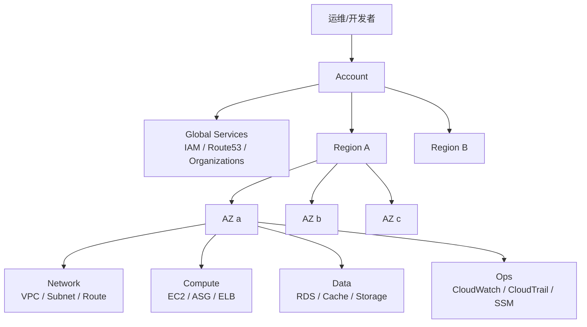

# AWS 全局地图

这一节不先背服务名，而是先把 AWS 当成一台“全球分布、分层运营的数据中心操作系统”来看。

---

## 一句话定位

AWS 全局地图解决的是：**你的资源到底归谁管、放在哪、跨到哪一层才会影响谁。**

---

## 最小心智模型

先别把 AWS 看成一堆服务名词，先看成 4 层：

1. **账户边界层**：`Account`
2. **地理部署层**：`Region / AZ`
3. **全局控制层**：`IAM`、部分 DNS/CDN/组织类能力
4. **业务资源层**：VPC、EC2、RDS、S3、CloudWatch 等具体资源

压成一句话就是：

> Account 决定“是谁的地盘”，Region/AZ 决定“资源放哪”，Global service 决定“哪些能力跨区域管全局”，具体服务再落到网络、计算、存储、数据、观测这些业务层里。

---

## 总体架构图



怎么读这张图：

- 你先进入一个 **AWS Account**。
- 在这个账户里，你选择一个 **Region** 部署资源。
- 一个 Region 下面会有多个 **AZ（Availability Zone）**。
- 绝大多数业务资源都是按 Region 或 VPC 来组织，不是全局随便漂着。
- 但少数能力是 **Global** 的，比如 IAM 这种身份权限控制，不是你切到北京区和东京区就两套完全独立世界。

---

## 核心资源 / 概念

### 1. Account

**它是什么**：AWS 的账户边界。

**它在系统里干嘛**：
- 充当资源、权限、账单、配额的第一层隔离边界
- 决定“这是谁家的资源”
- 是你做多环境、多团队隔离的基础单位

**它位于哪一层**：账户边界层。

**运维视角理解**：
把 Account 理解成“云上的独立租户/独立机房账本”。
不同 Account 之间默认不是一锅粥，权限、账单、资源清单天然隔开。

---

### 2. Region

**它是什么**：AWS 的地理区域，例如 `us-east-1`、`ap-southeast-1`。

**它在系统里干嘛**：
- 决定资源主要部署在哪个地理区域
- 决定延迟、合规、容灾策略、部分服务可用性
- 是很多资源的“最大作用域”

**它位于哪一层**：地理部署层。

**运维视角理解**：
Region 就像“大区级数据中心集群”。
很多东西是“区域内可见，跨区域默认不互通不共享”。

---

### 3. Availability Zone（AZ）

**它是什么**：Region 内彼此隔离的可用区。

**它在系统里干嘛**：
- 提供更细粒度的容灾隔离
- 让你把应用跨 AZ 部署，降低单机房/单电力域故障影响

**它位于哪一层**：地理部署层，Region 的下一层。

**运维视角理解**：
AZ 更像“同城不同机房故障域”，不是另一个 Region。
它强调的是高可用，而不是跨国跨洲。

---

### 4. Global Services

**它是什么**：作用域不按单个 Region 切开的能力。

常见例子：
- `IAM`
- `Route 53`
- `Organizations`
- 部分 CDN / 边缘能力

**它在系统里干嘛**：
- 统一身份、账号结构、域名解析、边缘接入等全局控制面能力

**它位于哪一层**：全局控制层。

**运维视角理解**：
Global service 不是“全世界都部署一份业务资源”，而是“它的控制面不是按单 Region 心智来管理”。

---

### 5. Core Layers（核心业务层）

你后面学 AWS，最好一直按层看：

1. **Identity / Governance**：IAM、Organizations、KMS
2. **Network**：VPC、Subnet、Route、IGW、NAT、SG
3. **Compute**：EC2、ASG、ELB、Lambda
4. **Storage / Data**：S3、EBS、EFS、RDS、DynamoDB、ElastiCache
5. **Observability / Ops**：CloudWatch、CloudTrail、Config、SSM

**运维视角理解**：
以后任何问题都别上来就说“AWS 坏了没”。
先问：**是身份层、网络层、计算层、数据层，还是观测层的问题？**

---

## 真实操作路径

这一节先不创建大量资源，先建立“定位感”。

### 控制台视角

你进 AWS 控制台后，建议先看这几个位置：

1. **右上角 Region 选择器**
   - 这是最容易犯错的地方之一
   - 很多“我机器去哪了”的问题，本质是你切错了 Region

2. **Account 菜单 / 账户 ID**
   - 确认你当前在哪个账号
   - 多账号环境里，切错 Account 比切错 Region 更危险

3. **IAM 控制台**
   - 观察它更像全局权限控制面，而不是某个业务区里的资源列表

4. **EC2 / VPC / RDS 控制台**
   - 观察它们都有明显 Region 归属
   - 同时留意很多资源还会继续归属到某个 VPC、某个 Subnet、某个 AZ

### CLI 视角

先建立三个基本动作：

```bash
# 你是谁（当前凭证属于哪个账户）
aws sts get-caller-identity

# 你默认往哪个 Region 打
aws configure list

# 看有哪些 Region
aws ec2 describe-regions --output table
```

如果已经配置好凭证，`aws sts get-caller-identity` 通常是第一条“定位命令”：

- 当前是谁
- 属于哪个 Account
- 用的是哪套身份

这比一上来盲点控制台稳得多。

### 配置 / 运行视角

你以后操作 AWS，脑子里至少同时挂着 3 个定位问题：

- **我现在在哪个 Account？**
- **我现在在哪个 Region？**
- **我要查的是全局控制面资源，还是区域内业务资源？**

这三个问题没定位清楚，后面几乎所有操作都可能偏。

---

## 常见误区

### 误区 1：把 Region 和 AZ 当成一回事

不对。

- `Region` = 大区
- `AZ` = 大区里的隔离机房/故障域

你做跨 AZ 高可用，不等于跨 Region 容灾。

---

### 误区 2：以为所有服务都是全局的

不对。

大多数业务资源都不是全局资源，很多都强依赖 Region。

典型症状：
- 控制台里“找不到实例”
- CLI 查不到资源
- 实际上只是查错 Region 了

---

### 误区 3：以为 Account 只是登录壳子

不对。

Account 是强隔离边界，关系到账单、权限、资源归属、配额、审计。
多账号策略是 AWS 生产治理的基本功，不是装饰。

---

### 误区 4：把 IAM 当成“某台机器上的用户表”

不对。

IAM 是 AWS 控制面的身份与授权系统，不是 Linux `/etc/passwd` 的云版本。
它管的是“谁能对哪些 AWS 资源做什么动作”。

---

### 误区 5：一上来背服务名，不先看链路和层次

这会很快变成名词堆。

更稳的学法是：

`Account -> Region/AZ -> IAM -> VPC -> Compute -> Data -> Observability`

也就是先把底盘和边界学明白，再学资源。

---

## 排障顺序

这一节先建立最通用的 AWS 定位排障顺序。

### 场景：你“看不到资源”或“操作不生效”时，先按这个顺序查

1. **身份层**
   - 我现在用的是哪套凭证？
   - 是不是切错账号/角色了？
   - `aws sts get-caller-identity`

2. **区域层**
   - 我现在看的 Region 对吗？
   - 控制台右上角和 CLI 默认 Region 是否一致？

3. **资源作用域层**
   - 这是 Global resource，还是 Regional resource？
   - 它是不是还归属于某个 VPC / Subnet / AZ？

4. **权限层**
   - 我是“资源不存在”，还是“我没权限看到/改它”？
   - 看错误码是 `NotFound` 还是 `AccessDenied`

5. **资源状态层**
   - 资源是真的没创建成功，还是处于 pending / failed / detached 之类状态？

你会发现，很多 AWS 初学者问题，本质不是“不会服务”，而是**没先定位作用域和边界**。

---

## 这一节的四个学习维度判断

当前这节的目标不是立刻会部署，而是先把地图装进脑子。

- **Orientation**：重点训练。你要能说出 Account、Region、AZ、Global service 分别在图上的位置。
- **Explanation**：你要能用自己的话解释“为什么切错 Region 会像资源消失”。
- **Operation**：先掌握最小定位动作：看账户、看 Region、看身份。
- **Diagnosis**：先学会排第一层问题：账号、区域、作用域。

如果这节吃透了，你就从“知道 AWS 是一堆名词”开始进入真正的 `认路` 阶段。

---

## 口袋压缩版

- `Account` 是第一层边界：资源、权限、账单、配额先按它隔离。
- `Region` 决定资源部署的大区，`AZ` 是 Region 内的隔离故障域。
- `Global service` 管的是跨区域的控制面能力，不代表所有资源都全局可见。
- AWS 学习和排障都应该按层走：**身份 -> 区域 -> 网络/计算/数据 -> 观测**。
- 很多“资源不见了”的第一反应，不是怀疑 AWS，而是先查 **账号 + Region + 作用域**。

---

## 一个短小考题

如果你在控制台里突然“找不到昨天创建的 EC2 实例”，你排查时第一反应先看哪两个定位点？为什么？
