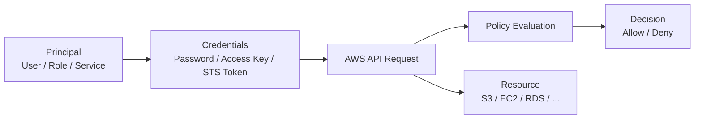

# AWS IAM

这一节先不把 IAM 讲成 `User / Role / Policy` 名词表，而是先把它看成 AWS 的“身份与授权控制面”。

---

## 一句话定位

IAM 解决的是：**谁在调用 AWS、拿的是什么凭证、被允许做什么、为什么会被拒绝。**

---

## 最小心智模型

先抓最小主链：

> **身份主体（Principal） -> 凭证（Credentials） -> 发起 API 调用 -> 策略评估（Policy Evaluation） -> Allow / Deny**

你后面看到的 user、role、STS、temporary credentials、access key，本质都在这条线上。

压成一句话：

> IAM 不是机器登录系统，而是 AWS 控制面的门禁系统：先确认“你是谁”，再判断“你能对哪个资源做什么动作”。

---

## 在 AWS 全局地图里它在哪

IAM 位于上一节说的 **全局控制层 / Identity 层**。

它不直接承载业务流量，不像 EC2 跑应用、RDS 存数据；它更像所有 AWS 资源前面的“统一鉴权入口”。

所以你以后遇到 AWS 问题，要经常先区分：

- 这是 **身份授权问题**？
- 还是 **网络/计算/数据资源问题**？

很多“服务起不来”的第一层根因其实不是实例坏了，而是：

- API 根本没权限调用
- 服务之间没法 assume role
- 凭证过期
- 策略显式拒绝

---

## 总体关系图



怎么读：

- 先有一个 **身份主体**（人、服务、程序）。
- 它拿着某种 **凭证** 去调用 AWS API。
- AWS 在后面做 **策略评估**。
- 最后决定这次请求是 **允许** 还是 **拒绝**。

注意：IAM 的主战场不是“登录到 Linux 主机”，而是“调用 AWS API”。

---

## 核心资源 / 概念

### 1. Identity / Principal

**它是什么**：发起 AWS 操作的身份主体。

常见主体：
- IAM User
- IAM Role
- AWS Service Principal（比如 EC2、Lambda 代表服务自己）
- Federated Identity（来自外部身份系统）

**它在系统里干嘛**：
- 表示“到底是谁在做这件事”
- 是后续授权判断的起点

**它位于哪一层**：Identity 层。

**运维视角理解**：
先别急着区分十几种身份类型，先记住：

> 任何 AWS 权限问题，第一问都该是：**到底是谁在调用？**

---

### 2. IAM User

**它是什么**：账户里的长期身份，通常给人或少量遗留程序使用。

**它在系统里干嘛**：
- 可以用于控制台登录
- 可以拥有 access key 做程序化访问

**它位于哪一层**：Identity 层。

**运维视角理解**：
IAM User 更像“长期身份对象”。
但在现代生产里，**不应该把它当万能入口**，尤其不该到处散发长期 access key。

**和 Role 的关键区别**：
- User 偏长期身份
- Role 偏可被临时获取/切换的身份能力

---

### 3. IAM Role

**它是什么**：一种不固定绑定某个人、而是“谁满足条件谁可临时扮演”的身份。

**它在系统里干嘛**：
- 给服务授予权限（EC2 / Lambda / ECS 等）
- 给人做跨账号访问
- 给临时会话发放权限

**它位于哪一层**：Identity 层。

**运维视角理解**：
Role 是 AWS 里最值得先建立正确直觉的对象。

你可以把它理解成：

> Role 不是一个长期拿在手上的账号，而是一套“可被临时借用的权限身份”。

这就是为什么云上最佳实践普遍是：
- 人通过登录 / SSO / AssumeRole 拿临时权限
- 服务通过 Role 拿临时权限
- 少发长期 key

---

### 4. Policy

**它是什么**：描述“允许/拒绝哪些动作”的规则文档，通常是 JSON。

**它在系统里干嘛**：
- 定义能执行哪些 `Action`
- 作用于哪些 `Resource`
- 在什么 `Condition` 下生效

**它位于哪一层**：Authorization（授权）子层。

**运维视角理解**：
Policy 不是“用户组备注”，它是真正决定 API 能不能过的规则引擎输入。

你先记住最小骨架：

- `Effect`: Allow / Deny
- `Action`: 能做什么
- `Resource`: 对什么资源做
- `Condition`: 在什么条件下做

---

### 5. Temporary Credentials

**它是什么**：通过 STS 等机制签发的临时凭证，通常包含：
- `AccessKeyId`
- `SecretAccessKey`
- `SessionToken`
- 过期时间

**它在系统里干嘛**：
- 支持临时访问
- 减少长期密钥暴露风险
- 支持 role assumption、跨账号访问、服务身份

**它位于哪一层**：Identity + Credential 子层。

**运维视角理解**：
临时凭证是 AWS 权限体系的现代默认姿势。

以后看到很多成功实践，本质都在干一件事：

> 尽量不要把长期钥匙塞给人和程序，而是按需发短期通行证。

---

### 6. STS（Security Token Service）

**它是什么**：签发临时安全凭证的服务。

**它在系统里干嘛**：
- AssumeRole
- 获取临时 session
- 支持联邦身份接入

**它位于哪一层**：全局控制层里的身份凭证服务。

**运维视角理解**：
可以把 STS 理解成“临时门禁票据发放处”。
Role 是权限身份模板，STS 是把模板兑现成临时凭证的发证机构。

---

## 最小可工作的主链

这一节最重要的是这条线：

### 场景：你在本地 CLI 调 AWS

1. 你先有一个身份来源
   - 可能是 IAM User 的 access key
   - 也可能是 SSO 登录后拿到的会话
   - 也可能是先 assume role

2. CLI 拿到一组凭证
   - 长期 key 或临时 key

3. 你执行命令
   ```bash
   aws s3 ls
   ```

4. AWS 收到 API 请求后做权限判断
   - 这个身份是谁
   - 它有哪些 policy
   - 目标资源是什么
   - 有没有显式 deny

5. 最终结果
   - 允许：返回结果
   - 拒绝：`AccessDenied`

你后面所有 IAM 排障，本质都在拆这 5 步。

---

## 真实操作路径

### 控制台视角

建议先看这几个位置：

1. **IAM 控制台 -> Users**
   - 看长期身份对象长什么样
   - 看它可挂哪些 policy

2. **IAM 控制台 -> Roles**
   - 看服务角色和跨账号角色
   - 观察 trust relationship

3. **IAM 控制台 -> Policies**
   - 看 AWS 托管策略和自定义策略
   - 理解 policy 是规则，不是注释

4. **IAM 控制台 -> Access Analyzer / Last accessed（如果可用）**
   - 帮你看权限是否过宽、实际是否使用过

### CLI 视角

先记住几个最值钱的定位命令：

```bash
# 当前是谁
aws sts get-caller-identity

# 当前 CLI 配置来源
aws configure list

# 列出当前账户里的 role（需要权限）
aws iam list-roles

# 看某个角色的信任策略
aws iam get-role --role-name MyRole
```

如果是排障，`aws sts get-caller-identity` 几乎永远是第一条。

它回答三个问题：
- 你现在是谁
- 你属于哪个 Account
- 你当前到底是不是已经切到目标 Role

### 配置 / 服务视角

在真实生产里，更常见的不是“人手动点控制台”，而是：

- EC2 实例通过 instance profile 拿 role
- Lambda 通过 execution role 调 AWS
- CI/CD 通过 OIDC / AssumeRole 拿临时凭证
- 跨账号运维通过 role switch 进入目标账号

也就是说，IAM 不只是“人能不能点按钮”，更是“服务之间如何安全调用”的底座。

---

## 常见误区

### 误区 1：把 IAM 当成 Linux 用户系统

不对。

IAM 不主要解决 shell 登录，它主要解决 AWS API 权限控制。

---

### 误区 2：User 和 Role 只是两个不同名字的账号

不对。

关键差异不是“名字不同”，而是：
- User 偏长期身份
- Role 偏临时借用的权限身份

这是理解现代 AWS 权限设计的关键分水岭。

---

### 误区 3：给程序塞长期 Access Key 很正常

技术上能跑，但从工程和安全视角，通常不是好习惯。

更稳的方向一般是：
- 服务用 Role
- 人用 SSO / AssumeRole
- 程序尽量用临时凭证

---

### 误区 4：有 Allow 就一定能访问

不对。

IAM 最坑的地方之一就是：
- 可能有别的策略显式 Deny
- 可能有资源策略拦截
- 可能有 SCP / permission boundary / session policy 继续收紧

所以“我明明配了 Allow 为什么还不行”是 IAM 经典问题。

这一节先记住：**Allow 不是全局无敌，显式 Deny 优先级更高。**

---

### 误区 5：权限问题只影响人，不影响服务

不对。

云上很多事故恰恰是服务身份问题：
- EC2 没挂对 role
- Lambda role 缺权限
- EKS / ECS 工作负载没有正确拿到云权限

---

## 排障顺序

### 场景：一个 AWS 操作报 `AccessDenied`

按这个顺序查：

1. **先确认主体是谁**
   - `aws sts get-caller-identity`
   - 先别猜，先看当前到底是哪套身份

2. **确认拿的是长期凭证还是临时凭证**
   - 有没有 session token
   - 凭证是否过期
   - 是不是根本没 assume 到目标 role

3. **确认请求动作是什么**
   - 被拒的是哪个 API action
   - 例如 `s3:GetObject`、`ec2:DescribeInstances`

4. **确认资源范围是什么**
   - policy 允许的是不是这个具体资源 ARN
   - 有没有只放通一部分 bucket / path / region

5. **看授权链上有没有其他收紧点**
   - identity-based policy
   - resource-based policy
   - permission boundary
   - SCP
   - session policy

6. **看是否显式 Deny**
   - 如果有显式 deny，优先级高于 allow

### 场景：服务访问 AWS 失败

优先查：

1. 服务到底在用哪个 role
2. 这个 role 是否真的被挂到服务上
3. role 的 trust policy 是否允许被该服务 assume
4. role 本身的 permissions policy 是否放通目标 API
5. 凭证是否已正确注入运行时

很多“程序调用 AWS 失败”的根因，其实不是 SDK 坏了，而是 **role 没挂对 / 没 assume 成功 / policy 不匹配**。

---

## 和相邻概念的关键对比

### User vs Role

- **User**：长期身份对象
- **Role**：临时可扮演身份

一句话区分：

> User 像长期工牌，Role 像临时授权的工作证。

### Authentication vs Authorization

- **Authentication（认证）**：你是谁
- **Authorization（授权）**：你能干什么

IAM 同时覆盖这两件事，但排障时一定要分开想。

### Role vs Policy

- **Role**：身份容器 / 可被扮演的权限身份
- **Policy**：附着在身份或资源上的规则

Role 决定“你以谁的身份出现”，Policy 决定“这个身份被允许做什么”。

---

## 这一节的四个学习维度判断

- **Orientation**：你要能把 IAM 放到 AWS 的全局控制层 / 身份层。
- **Explanation**：你要能用自己的话讲出 `身份主体 -> 凭证 -> API -> 策略评估 -> Allow/Deny` 这条链。
- **Operation**：你要知道先用 `aws sts get-caller-identity` 定位当前身份，再看 role / policy。
- **Diagnosis**：你要知道权限报错先查“是谁 + 拿的什么凭证 + 哪个 action + 哪条策略拦了”。

如果这节吃透，你对 AWS 的理解就从“名词辨认”开始进入“控制面与授权链路理解”。

---

## 口袋压缩版

- IAM 是 AWS 的 **身份与授权控制面**，不是 Linux 用户系统。
- 最小主链是：**主体 -> 凭证 -> API 调用 -> 策略评估 -> Allow/Deny**。
- `User` 偏长期身份，`Role` 偏临时借用身份，现代生产更偏向 Role + 临时凭证。
- 排障第一步通常不是改策略，而是先确认：**当前到底是谁在调用**。
- `AccessDenied` 不只可能因为没 Allow，也可能因为别的策略显式 Deny 或授权链其他环节在收紧。

---

## 一个短小考题

如果一台 EC2 上运行的程序访问 S3 时报 `AccessDenied`，你排查 IAM 时第一反应先看哪两件事？
