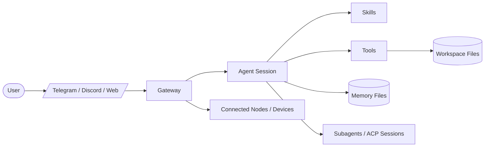
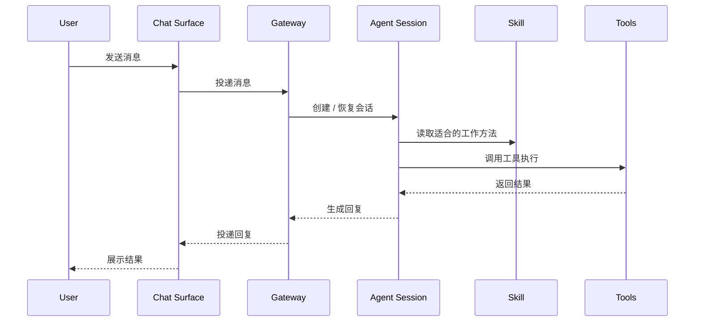

# OpenClaw 学习笔记

这份笔记是给浏览器读的，方便直接看 Mermaid 图。

## 一句话理解

OpenClaw 是一套让 AI 从“只会聊天”变成“能接消息、读上下文、用工具、跑任务、保存记忆、拆子任务”的运行框架。

## 总体架构图

## 怎么读这张图

- `User` 是你，发消息和提任务的人。
- `Chat Surface` 是 Telegram、Discord、Web 之类的入口。
- `Gateway` 负责接住外部消息并转给对应会话。
- `Agent Session` 是真正理解任务、组织动作、生成回复的核心单元。
- `Skills` 是做事方法包，负责“怎么做更稳”。
- `Tools` 是手脚，负责读写文件、执行命令、抓网页、开子会话等动作。
- `Workspace Files` 是工作区文件，提供真实上下文和可操作对象。
- `Memory Files` 是长期记忆和会话延续的外部存储。
- `Subagents / ACP Sessions` 是拆出去的子任务或专项会话。
- `Connected Nodes / Devices` 是扩展到其他节点或设备的能力。

## 核心理解

把它压缩成一句话：

> OpenClaw 通过 `Gateway` 接收请求，由 `Agent Session` 结合 `Skills` 和 `Tools` 在真实工作区里完成任务，并用 `Memory`、`Subagents`、`Nodes` 扩展持续性和执行范围。

## 请求流图

## 关键分层

### 1. 接入层

- 聊天平台或 Web 界面
- 负责把请求送进 OpenClaw

### 2. 路由层

- `Gateway`
- 负责连接、转发、服务入口

### 3. 执行层

- `Agent Session`
- 真正决定下一步、调用技能和工具

### 4. 方法层

- `Skills`
- 把某类工作固化成稳定流程

### 5. 操作层

- `Tools`
- 让 agent 能真正读、写、查、跑

### 6. 持久层

- `Workspace Files`
- `Memory Files`
- 让任务和上下文不只停留在聊天窗口里

### 7. 扩展层

- `Subagents / ACP Sessions`
- `Connected Nodes / Devices`
- 用于拆分复杂任务或连接其他执行节点

## 和普通聊天机器人的区别

普通聊天机器人通常是：

- 你问
- 它答
- 会话结束

OpenClaw 更像：

- 你提任务
- 系统接住请求
- agent 结合上下文决策
- skill 决定工作套路
- tool 执行真实动作
- 必要时拆给子任务
- 最后把结果返回给你

## 现在先记住的 3 个点

- `Gateway` 负责接入和转发。
- `Session` 负责理解和执行。
- `Skills + Tools` 决定怎么做，以及能做到什么程度。

## 下一步适合学什么

可以继续往下展开成任意一个方向：

- OpenClaw 组件拆解
- Gateway 和 Session 的关系
- Skill 是怎么触发和生效的
- Tools 和执行边界
- Memory 是怎么工作的
- 子会话 / ACP 是怎么协作的
- 部署和排障视角的 OpenClaw
