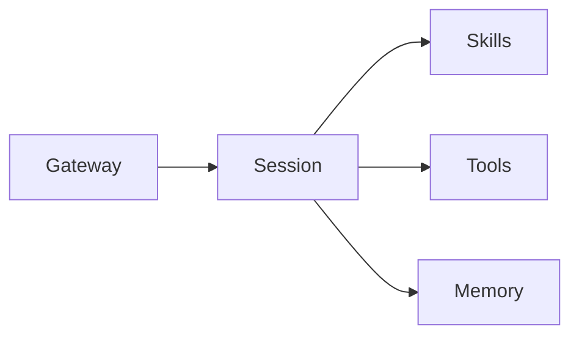

# OpenClaw 核心组件

这一页专门拆开讲 OpenClaw 最核心的几个部件：`Gateway`、`Session`、`Skills`、`Tools`、`Memory`。

## 先记一句话

> Gateway 负责接入，Session 负责理解和执行，Skills 提供方法，Tools 提供动作，Memory 提供延续。

---

## 1. Gateway

### 它是什么

`Gateway` 是 OpenClaw 的入口和转发层。

### 它主要干什么

- 接收 Telegram / Discord / Web 等外部消息
- 管理连接状态
- 把请求路由到合适的 agent session
- 把结果再发回原来的渠道

### 你可以怎么理解

把它当成系统前台 + 总机。

它本身不负责深度思考任务细节，它更像交通枢纽。

---

## 2. Session

### 它是什么

`Session` 是真正工作的上下文单元。

### 它主要干什么

- 读取当前消息和上下文
- 决定要不要调用 skill
- 决定要不要用工具
- 组织多步任务
- 保持一段连续对话或任务过程的上下文

### 为什么重要

如果没有 session，agent 每次都像失忆一样只能做单轮问答。

有了 session，系统才能连续做事，比如：

- 继续上次没做完的任务
- 记得刚才看过哪个文件
- 记得用户刚刚确认了什么

### 你可以怎么理解

把它当成“真正办事的人”。

---

## 3. Skills

### 它是什么

`Skill` 是工作方法包，不是模型本身，也不是工具本身。

### 它主要干什么

- 给 agent 一套更稳定的做事流程
- 把特定场景的套路沉淀下来
- 告诉 agent 在什么情况下该怎么处理任务

### 举例

- 一个教学习的 skill
- 一个 GitHub 操作 skill
- 一个做浏览器招聘抓取的 skill

### 为什么它重要

同样一个模型，没有 skill 的时候偏通用；有 skill 后，在某一类任务上会更稳、更像熟手。

### 你可以怎么理解

把它当成“标准作业流程 + 专项经验包”。

---

## 4. Tools

### 它是什么

`Tools` 是 agent 能实际调用的操作能力。

### 常见工具类型

- 读文件
- 写文件
- 精确编辑文件
- 执行命令
- 管理后台进程
- 抓网页
- 开子会话
- 查 memory
- 图像/视频处理

### 为什么它重要

没有 tools，AI 只能说建议。

有了 tools，AI 才能：

- 直接改文件
- 运行脚本
- 获取真实系统状态
- 自动完成一段工作流

### 你可以怎么理解

把它当成“手脚和工具箱”。

---

## 5. Memory

### 它是什么

`Memory` 是 OpenClaw 的持续信息层。

### 它主要干什么

- 记录长期偏好
- 保存关键决策
- 保存每日工作记录
- 帮助未来会话延续背景

### 注意点

Memory 不是无限全知记忆，而是通过文件和检索机制来保留上下文。

这意味着：

- 想长期记住，就要写到文件里
- 想安全使用，就要注意哪些内容能在主会话看，哪些不能在共享场景泄露

### 你可以怎么理解

把它当成“外部化的大脑笔记”。

---

## 它们之间怎么配合

最简理解：

- Gateway 把请求送进来
- Session 决定怎么办
- Skills 提供方法
- Tools 执行动作
- Memory 提供延续

---

## 最容易混淆的 3 组概念

### Gateway vs Session

- `Gateway` 更像入口和路由
- `Session` 更像真正处理任务的执行上下文

### Skill vs Tool

- `Skill` 决定“怎么做更好”
- `Tool` 决定“具体能做什么动作”

### Session vs Memory

- `Session` 是当前这段过程里的上下文
- `Memory` 是跨会话保留下来的信息

---

## 你学到这一步该会什么

看完这页，你至少应该能回答：

- 为什么 OpenClaw 不只是一个聊天机器人
- Gateway 和 Session 的分工差别
- Skill 和 Tool 的差别
- Memory 为什么是文件化和可检索的

---

## 下一步

适合接着看：

- [OpenClaw 请求流](OpenClaw-Request-Flow)
- [OpenClaw 总览](OpenClaw)
