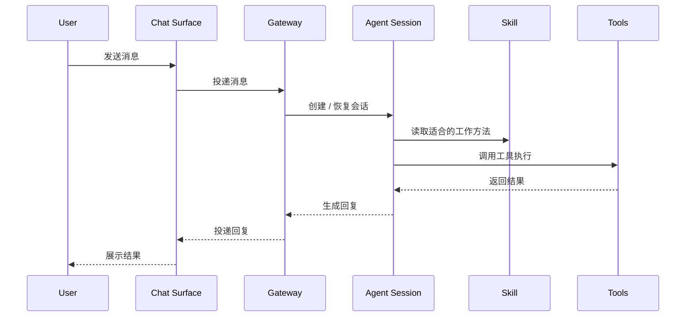

# OpenClaw 请求流

这一页专门讲：一条消息从你发出来，到系统真正执行，再到结果回给你，中间发生了什么。

## 请求流总图

## 分步骤理解

### 1. 你发出请求

你通过 Telegram、Discord 或 Web 发出一句话，比如：

- 教我学 OpenClaw
- 帮我修改配置文件
- 生成一张架构图

### 2. 外部渠道把消息送给 Gateway

聊天平台本身不处理任务细节，它只是消息来源。

Gateway 收到消息后，会知道：

- 这是哪个账号收到的
- 来自哪个渠道
- 是群聊还是私聊
- 应该关联到哪个 session

### 3. Gateway 创建或恢复 Session

这一步很关键。

系统不会把每条消息都当成完全独立事件，而是尽量恢复你已有的上下文。

所以它会把消息交给一个现有会话，或者新建一个会话。

### 4. Session 判断怎么处理

Session 会看：

- 用户到底要什么
- 现在上下文里已经有什么
- 是否要调用某个 skill
- 是否需要工具
- 是否需要查 memory
- 是否需要拆给子会话

这一步其实就是 agent 的核心决策层。

### 5. Skill 提供方法

如果任务命中了某个 skill，session 会读这个 skill 的方法说明。

比如：

- 学习类任务 -> 用教学型 skill
- GitHub 操作 -> 用 GitHub skill
- MCP 配置 -> 用 mcporter skill

Skill 不直接执行动作，但它决定一类任务的更优套路。

### 6. Tools 执行动作

如果任务需要真实操作，session 会调用工具。

比如：

- `read` 读文件
- `write` 写文件
- `edit` 精确修改
- `exec` 跑命令
- `web_fetch` 抓网页
- `sessions_spawn` 开子会话

### 7. Tool 结果返回给 Session

工具执行后，结果会回到当前 session。

这时 session 会继续判断：

- 任务完成了吗
- 结果够不够
- 要不要再继续下一步
- 该怎么把结果解释给用户

### 8. Session 生成回复

到这一步，才是你平时感受到的“AI 回复”。

但这条回复其实是整个多步处理的最终展示，不只是模型随口输出。

### 9. Gateway 把回复送回原渠道

最后 Gateway 把结果发回 Telegram / Discord / Web，对你来说就看到消息返回来了。

---

## 这个流程最关键的启发

OpenClaw 不是：

- 用户发消息
- 模型直接吐字

而是：

- 用户发消息
- 系统建立上下文
- 判断任务类型
- 调用方法和工具
- 执行多步动作
- 再返回结果

所以它是“任务处理系统”，不是单纯的聊天壳。

---

## 常见分叉

真实世界里，请求流不一定总是这么直线。

有时还会分叉成：

- 查 Memory
- 拉起子会话
- 等待后台进程结果
- 生成图片/视频
- 给别的 session 发消息

所以你可以把上面的图理解成最小主干流程。

---

## 你学到这一步该会什么

看完这页，你至少应该能回答：

- 为什么一次回复背后可能有很多内部步骤
- Session 在请求流里为什么是核心
- Skill 和 Tool 分别插在流程的哪一段
- Gateway 为什么更像入口而不是大脑

---

## 下一步

适合接着看：

- [OpenClaw 核心组件](OpenClaw-Core-Components)
- [OpenClaw 总览](OpenClaw)
