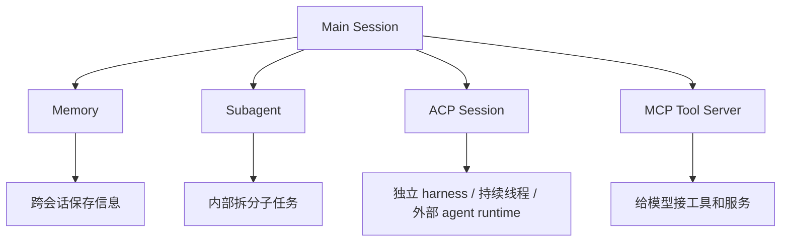

# OpenClaw Memory、Subagent 与 ACP

这一节讲 OpenClaw 里最像“真 agent 系统”的三块：`Memory`、`Subagent`、`ACP`。

## 一句话先记住

- `Memory` 负责跨会话保留重要信息
- `Subagent` 负责把复杂任务拆出去独立处理
- `ACP` 负责把任务交给外部/独立 coding harness 持续执行

这三者加起来，OpenClaw 才真正像一个能长期工作、能拆任务、能持续执行的 agent 系统。

---

## 1. Memory

### 它解决什么问题

如果没有 memory，session 一结束，很多关键背景就没了。

所以 memory 的核心价值是：

- 让系统跨会话延续上下文
- 保存长期偏好、重要决策、待办、经验
- 把“记住事情”从模型脑内记忆，变成外部化、可检索的文件化记忆

### 你可以怎么理解

Memory 不是神秘的“AI 永久记忆”，而更像：

- 长期笔记
- 工作日志
- 重要事实档案

### 在 OpenClaw 里通常长什么样

- `MEMORY.md`：长期记忆
- `memory/YYYY-MM-DD.md`：每日记录
- 检索工具：先查 memory，再按需要读具体内容

### 为什么这样设计

因为：

- 可控
- 可审计
- 可编辑
- 可避免在不合适的会话泄露长期隐私上下文

---

## 2. Subagent

### 它解决什么问题

主会话如果把所有事情都自己做，会越来越乱：

- 上下文变长
- 任务互相干扰
- 不同子问题混在一起
- 汇总和追踪变困难

所以 Subagent 的核心价值是：

- 把复杂任务拆出去
- 给子任务独立上下文
- 让主会话保持清晰
- 支持并行或半独立处理

### 你可以怎么理解

主会话像项目经理，Subagent 像专项同事。

比如：

- 主会话负责和用户对齐目标
- 子会话去查文档
- 子会话去整理代码
- 子会话去跑分析
- 最后主会话统一收口并回复用户

### 它的好处

- **隔离上下文**：子问题不污染主线程
- **提升组织性**：每个子任务边界更清晰
- **便于协作**：结果可以汇总回来
- **适合复杂任务**：尤其是多步骤、多模块问题

### 在 OpenClaw 里通常怎么起

Subagent 一般是主会话内部主动拆分出来的子会话，常见特征：

- 仍属于 OpenClaw 自己的会话体系
- 主要通过 `sessions_spawn` 起新会话
- runtime 常见为 `subagent`
- 偏向“内部拆活”和“同系统协作”

---

## 3. ACP

### ACP 全称是什么

ACP 一般可以先记成：

> **Agent Client Protocol**

你现在不用先把它理解成一套很学术的协议规范，先抓住它在 OpenClaw 里的角色。

### 它是什么

ACP 可以先粗略理解成：

> 把任务交给独立的 agent/coding harness 去持续执行的一种接入方式。

在当前 OpenClaw 语境里，它常用于：

- 用户明确说“用 codex/claude code/cursor/gemini 之类去做”
- 需要 thread-bound 的外部/独立 agent 会话
- 需要更专门的 coding runtime 来持续处理任务

### 它解决什么问题

普通子会话虽然能拆任务，但 ACP 更强调：

- 独立运行时
- 持续线程
- 明确绑定某个 agent/harness
- 更适合编码或复杂执行场景

### 你可以怎么理解

如果 Subagent 是“内部专项同事”，那 ACP 更像“接入一个专门工作台上的外部专家”。

比如：

- 主会话负责总体协调
- ACP 会话在它自己的 runtime 里持续做代码相关任务
- 做完后再把结果返回主会话

---

## ACP、Subagent、MCP 的对比图

这个图最关键的区别是：

- `Memory`：保存信息
- `Subagent`：拆任务
- `ACP`：把任务交给独立 agent runtime 持续做
- `MCP`：给模型接工具/服务，不是接外部 agent 工作台

---

## ACP 和 Subagent 到底哪里不一样

### 1. 定位不同

- `Subagent`：OpenClaw 内部拆分任务用的子会话
- `ACP`：把任务交给某个外部/独立 harness 的会话接入方式

### 2. 上下文边界不同

- `Subagent`：虽然独立，但仍然更像 OpenClaw 自己体系里的内部协作者
- `ACP`：更强调“这是另一个运行时里的 agent 线程”

### 3. 使用场景不同

- `Subagent`：资料整理、子问题分析、内部并行拆活
- `ACP`：明确要求某类 coding agent/harness 执行，例如 codex、claude code、cursor、gemini 等

### 4. 持续性不同

- `Subagent`：通常偏本次任务内的子会话
- `ACP`：更常见 thread-bound、持久线程、持续推进式工作流

### 5. 主从关系感不同

- `Subagent`：更像主会话内部拉出来的同事
- `ACP`：更像把任务派给另一个专业工作台上的执行者

---

## ACP 和 Subagent 在实现上的不同点

这里讲的是 OpenClaw 当前工作方式下的“实现侧理解”，不是抽象概念。

### Subagent 的实现侧特征

- 通常使用 `sessions_spawn`
- `runtime` 常见是 `subagent`
- 更偏 OpenClaw 自己管理的隔离会话
- 子会话继承父工作区，方便在同一任务空间协作
- 更像系统内部拆线程

### ACP 的实现侧特征

- 也通常通过 `sessions_spawn` 发起
- 但 `runtime` 是 `acp`
- 要显式指定 `agentId`（除非有默认 ACP agent）
- 常用于 thread-bound persistent session
- 目标不是本地 shell 进程，而是某个 ACP harness
- 当用户说“用 codex/claude code/cursor/gemini 做”，OpenClaw 会把它当成 ACP harness intent，而不是普通 exec 任务

### 最关键的一点

虽然两者都可能走 `sessions_spawn`，但：

- `subagent` 是“在 OpenClaw 里再开一个内部助手”
- `acp` 是“接到另一个 agent runtime / harness 上去持续做事”

所以差别不在于“有没有新会话”，而在于：

- **新会话属于谁的运行时**
- **任务交给谁执行**
- **会话是不是绑定某个外部 agent/harness**

---

## ACP 和 MCP 不一样

这是最容易混淆的点。

### MCP

MCP 一般是：

> **Model Context Protocol**

它解决的问题是：

- 怎么让模型接到工具
- 怎么让模型调用外部服务
- 怎么把外部能力标准化地暴露给模型

所以 MCP 更像：

- 工具接口层
- 服务接入层

### ACP

ACP 更像：

- agent 执行接入层
- 独立 runtime/harness 接入层

所以可以粗暴记成：

- `MCP`：接工具
- `ACP`：接 agent

---

## 为什么 ACP 很重要

因为有些任务不是“主会话顺手跑几个工具”就能搞定，而是需要：

- 更专门的编码环境
- 更持久的线程
- 和某个外部 agent 的持续协作
- 把复杂工作托管给更适合的执行 runtime

这时候 ACP 就很有价值。

---

## 为什么这三块很关键

因为它们让 OpenClaw 从“会聊天、会调工具”，升级成：

- **能记住**：Memory
- **能拆活**：Subagent
- **能把复杂任务派给独立工作台持续执行**：ACP

这就是为什么说 OpenClaw 更像 agent 系统，而不是单轮聊天机器人。

---

## 这一节你至少要会回答

- 为什么 memory 不是“神秘永久记忆”，而是文件化/可检索的信息层
- 为什么复杂任务适合拆给 subagent
- ACP 和普通子会话的大致区别是什么
- ACP 和 MCP 最核心的区别是什么

---

## 下一步

适合接着学：

- OpenClaw 的工具系统怎么工作
- OpenClaw 的 skill 触发机制
- OpenClaw 的部署与排障视角
