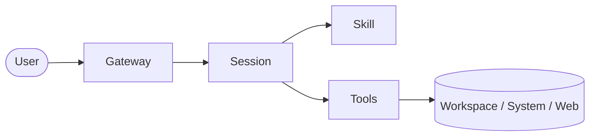

# OpenClaw 工具系统

这一节讲 OpenClaw 里的 `Tools`：它们是什么、为什么重要、在整体架构里处于什么位置。

## 一句话先记住

> Skill 决定怎么做，Tool 决定真正能做什么动作。

没有 tool，agent 大多只能“说”。
有了 tool，agent 才能“做”。

---

## 1. Tool 到底是什么

Tool 是 OpenClaw 暴露给 agent 的可调用能力。

它不是抽象建议，而是能真正执行动作的接口。

比如：

- 读文件
- 写文件
- 精确修改文件
- 执行命令
- 管理后台进程
- 抓取网页
- 生成图片/视频
- 分析图片
- 开子会话
- 查 memory

所以 tool 的本质是：

> 让 agent 从“语言处理者”变成“动作执行者”。

---

## 2. Tool 在架构里处于什么位置

这张图要表达的是：

- 用户消息先进入系统
- Session 判断怎么处理
- Skill 决定工作套路
- Tool 负责把动作真正打到工作区、系统、网页或其他资源上

所以 Tool 更靠近“执行层”。

---

## 3. 为什么 Tool 很关键

如果没有 tools，AI 常常只能这样：

- 告诉你一个命令应该怎么写
- 建议你去改某个文件
- 建议你去打开某个网页

但它自己并没有真的做。

有了 tools 以后，agent 才能：

- 直接读文件看内容
- 直接写文件或修配置
- 直接跑命令拿真实结果
- 直接抓网页内容
- 直接开子会话分工
- 直接做图像/视频相关操作

这就是为什么 OpenClaw 更像“任务系统”，而不是“聊天机器人”。

---

## 4. OpenClaw 里常见的工具类别

### 文件类工具

典型代表：

- `read`
- `write`
- `edit`

作用：

- 读工作区文件
- 写新文件
- 精确修改现有文件

适合：

- 改配置
- 写文档
- 调整脚本
- 更新 skill

---

### 执行类工具

典型代表：

- `exec`
- `process`

作用：

- 执行 shell 命令
- 管理后台运行中的任务
- 轮询长任务结果

适合：

- 跑构建
- 查系统状态
- 处理长时间任务
- 跟踪命令输出

---

### 会话编排类工具

典型代表：

- `sessions_spawn`
- `sessions_send`
- `sessions_list`
- `sessions_history`
- `sessions_yield`
- `subagents`

作用：

- 起新会话
- 给别的会话发消息
- 拉子会话协作
- 查看其他会话状态

适合：

- 多任务分工
- 子 agent 协作
- ACP / Subagent 调度

---

### 知识与外部信息类工具

典型代表：

- `web_fetch`
- `memory_search`
- `memory_get`

作用：

- 抓网页内容
- 搜记忆
- 精确读取记忆内容

适合：

- 查资料
- 回忆历史决策
- 引用已有上下文

---

### 多模态类工具

典型代表：

- `image`
- `image_generate`
- `video_generate`

作用：

- 分析图片
- 生成图片
- 生成视频

适合：

- 看图理解
- 做配图
- 生成演示素材

---

## 5. Tool 和 Skill 的区别

这个最容易混。

### Skill

Skill 是方法论和流程。

它解决的是：

- 这类任务该怎么做更稳
- 应该先做什么，再做什么
- 什么情况下切换模式

### Tool

Tool 是可执行动作。

它解决的是：

- 现在到底能做什么
- 能不能读文件
- 能不能写配置
- 能不能执行命令
- 能不能访问外部资源

所以粗暴记忆：

- `Skill`：怎么做
- `Tool`：做什么动作

---

## 6. Tool 和模型本身的区别

模型本身擅长：

- 理解语言
- 归纳信息
- 解释概念
- 规划步骤

但模型本身并不天然具备：

- 读你本机文件
- 执行命令
- 修改仓库
- 管理会话
- 连外部服务

这些能力是通过 tool 接进去的。

所以：

- 模型 = 大脑
- Tool = 手脚

---

## 7. Tool 使用为什么要小心

因为 tool 是真实动作，不是纸上谈兵。

比如：

- 写文件会真的改文件
- exec 会真的跑命令
- push 会真的推到 GitHub
- 外部抓取会真的访问网络

所以一个成熟的 agent 系统不能只考虑“能不能用 tool”，还要考虑：

- 什么时候该用
- 什么时候该先确认
- 怎么避免破坏性操作
- 怎么让输出可审计

这也是为什么 OpenClaw 会把工具能力、权限、流程、skill 结合起来管理。

---

## 8. 这一节最该带走的理解

看完这一节，你至少应该记住：

- Tool 是 agent 真正执行动作的能力
- Tool 处在执行层，连接 session 和外部世界
- Skill 负责方法，Tool 负责动作
- 没有 tool，OpenClaw 就很难真正落地做事

---

## 下一步

适合接着学：

- OpenClaw 的 skill 是怎么触发和生效的
- OpenClaw 的权限与安全边界
- OpenClaw 的部署与排障视角
