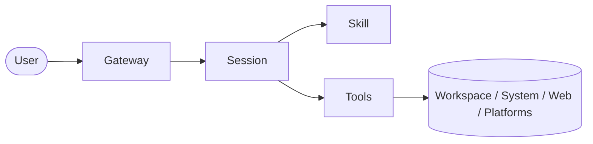

# OpenClaw 工具系统

这一节开始进入 OpenClaw 最“能干活”的一层：`Tools`。

前面几章你已经看到了：

- Gateway 把消息送进来
- Session 决定怎么处理
- Skill 提供做事方法

但如果没有 tools，前面这些都还只是“会想”。

真正让 agent 从“会解释”变成“会执行”的，是工具系统。

---

## 一句话先记住

> **Skill 决定怎么做，Tool 决定真正能做什么动作。**

再压缩一点：

- 没有 tool，agent 大多只能“说”
- 有了 tool，agent 才能“做”

所以你可以把 tool 理解成 agent 的“行动接口”。

---

## 1. Tool 到底是什么

Tool 是暴露给 agent 的**可调用能力**。

它不是建议，不是说明书，也不是模型脑内想象出来的步骤，而是：

> **可以真的执行动作、并返回结果的接口。**

比如，一个 tool 可以让 agent：

- 读文件
- 写文件
- 精确修改文件
- 执行 shell 命令
- 管理后台进程
- 抓网页
- 点浏览器页面
- 开子会话
- 查历史 session
- 存或读 memory
- 生成图片
- 分析图片

所以 tool 的核心价值是：

> **让 agent 从语言处理者变成环境中的操作者。**

---

## 2. Tool 在整套系统里的位置

先看图：

这张图要表达的是：

- 用户消息先进入 Gateway
- Gateway 把消息送到某个 Session
- Session 判断任务、理解上下文
- Skill 提供方法论
- Tool 把动作真正打到外部世界

所以：

- `Session` 更像决策中枢
- `Skill` 更像工作手册
- `Tool` 更像执行接口

如果你只记位置关系，就记这个：

> **Tool 更靠近“执行层”，离真实世界最近。**

---

## 3. 为什么 Tool 是 agent 系统的分水岭

很多普通聊天模型，最强的时候也只是：

- 告诉你命令应该怎么写
- 建议你去改哪个文件
- 分析网页可能有什么内容
- 推测某个错误大概是什么原因

但它们通常没有真的去做。

这就是“会说但不会动手”。

而 OpenClaw / Hermes 这种 agent 系统之所以更像真正的工作代理，是因为它们不仅能想，还能动：

- 真的读文件，而不是猜文件内容
- 真的跑命令，而不是口述命令
- 真的改配置，而不是建议你改配置
- 真的开浏览器，而不是说“你可以点这里”
- 真的拉起子任务，而不是只说“可以拆分一下”

所以你可以把有没有 tool，当成一个分水岭：

- **无 tool** → 主要是认知能力
- **有 tool** → 认知能力 + 执行能力

这也是为什么 agent 系统和普通聊天机器人看起来像一类东西，实质却差很多。

---

## 4. Tool 不只是“能力列表”，而是“边界列表”

理解 tool 有一个特别关键的角度：

> **Tool 不仅定义 agent 能做什么，也定义它不能做什么。**

比如：

- 有文件工具，就能改工作区文件
- 没有文件工具，就不能直接动文件
- 有 terminal，就能查系统状态、跑脚本、看 git
- 没有 terminal，就不能直接执行系统命令
- 有 browser，就能和动态网页交互
- 没有 browser，可能只能做静态抓取或文字分析
- 有 send_message，才能主动把结果发到外部平台
- 没有 send_message，就不能真正对外发送

这意味着 toolset 其实就是 agent 的**权限边界 + 能力边界**。

所以当你问“这个 agent 为什么不能做 X”，一个很常见的真实答案不是“模型不会”，而是：

> **它没有那个 tool，或者没有那个 toolset。**

---

## 5. OpenClaw / Hermes 里常见的工具类别

你不需要一上来背所有工具名，更重要的是先建立分类感。

### 5.1 文件类工具

典型能力：

- 读文件
- 写文件
- 搜索文件
- 精确 patch 文件

这类工具解决的是：

- 工作区里到底有什么
- 某个文件内容是什么
- 怎么把修改精确落到文件上

适合场景：

- 改配置
- 写文档
- 更新代码
- 搜索某个定义
- 检查某条规则写在哪

这是最基础也最常用的一类。没有文件类工具，很多“代码助手”其实只能做口头建议。

---

### 5.2 执行类工具

典型能力：

- 执行 shell 命令
- 启动长任务
- 管理后台进程
- 等待进程完成
- 读取日志输出

这类工具解决的是：

- 系统真实状态是什么
- 命令实际跑出来结果是什么
- 某个服务是不是启动了
- 某个测试到底有没有通过

适合场景：

- 跑构建
- 跑测试
- 看 git 状态
- 查端口 / 进程 / 磁盘
- 跑部署或脚本任务

对运维和工程任务来说，这类工具非常关键，因为它提供了**现场证据**。

---

### 5.3 浏览器 / Web 类工具

典型能力：

- 打开网页
- 点击页面
- 输入内容
- 获取页面快照
- 读取控制台信息
- 截图和视觉分析
- 静态网页搜索或抓取

这类工具解决的是：

- 网站真实页面长什么样
- 某个动态交互流程能不能走通
- 某个招聘站、后台系统、控制台网页到底返回了什么

适合场景：

- 浏览器自动化
- QA 测试
- 招聘站点探测
- 检查网页 UI/状态
- 需要 human-like interaction 的页面任务

这类工具让 agent 不只是“会请求网页”，而是能一定程度上“像人一样操作网页”。

---

### 5.4 会话编排类工具

典型能力：

- 开子会话
- 并行委派任务
- 查询历史 session
- 管理长期任务或 cron job

这类工具解决的是：

- 当前任务太复杂，是否要拆出去
- 哪些工作可以并行跑
- 怎么把主会话保持清晰
- 怎么让某个事情定时执行

适合场景：

- 多线研究
- 复杂代码任务拆分
- 定时任务
- 长期自动化
- 独立 worker / subagent 协作

这时候 tool 已经不仅是在“操作文件或系统”，而是在“操作 agent 自己的工作流”。

---

### 5.5 Memory / Knowledge 类工具

典型能力：

- 搜索 past sessions
- 保存 durable memory
- 检索工作区里的文档和知识
- 拉取外部资料

这类工具解决的是：

- 之前发生过什么
- 有没有稳定偏好需要沿用
- 某个项目里以前怎么做过
- 外部最新资料是什么

适合场景：

- 跨会话延续
- 回忆历史决策
- 用已有经验避免重复劳动
- 调研、查资料、查文档

注意这里要区分：

- tool 是“查/存”的动作
- memory 本身是“被查/被存”的内容层

---

### 5.6 多模态类工具

典型能力：

- 看图
- 生成图
- 转语音
- 处理媒体

这类工具解决的是：

- 图里到底有什么
- 能不能直接产出视觉材料
- 能不能把文字变成音频

适合场景：

- 截图排障
- 生成流程图/配图
- 做视觉化说明
- 发语音或媒体结果

这类工具让 agent 不再局限于纯文本环境。

---

## 6. Tool 和 Skill 的区别

这是最容易混的地方。

### Skill 是什么

Skill 是：

- 方法
- 策略
- runbook
- 经验总结
- 某类任务的更优做法

它回答的是：

- 这类任务应该怎么做更稳
- 先做什么，再做什么
- 遇到什么情况切路线

### Tool 是什么

Tool 是：

- 实际动作接口
- 真实执行能力
- 面向环境的调用入口

它回答的是：

- 现在到底能不能做这个动作
- 能不能读文件
- 能不能开浏览器
- 能不能跑命令
- 能不能发消息

所以最简洁的区别就是：

- `Skill`：**怎么做**
- `Tool`：**做什么动作**

如果你想类比：

- skill 像作战手册
- tool 像扳手、终端、浏览器、起重机

手册不会自己拧螺丝，工具也不会自己决定什么时候该拧。两者得配合。

---

## 7. Tool 和模型本身的区别

模型本身擅长的是：

- 理解语言
- 总结信息
- 解释概念
- 规划步骤
- 生成文本

但模型本身通常并不天然拥有：

- 读本机文件的权限
- 执行系统命令的权限
- 修改仓库的权限
- 和浏览器交互的权限
- 管理后台任务的权限
- 对外发消息的权限

这些都需要 tool 提供。

所以不要把“模型聪明不聪明”和“agent 能不能干活”混为一谈。

一个很聪明但没有工具的模型，很多时候仍然只能：

> **给建议，而不能交付结果。**

一个工具系统完善、流程也对的 agent，即使模型不是最顶级，也经常能交出更有用的结果。

---

## 8. Tool 调用为什么比普通回答更可信

这是工程上非常重要的一点。

普通口头回答的问题是：

- 可能来自经验猜测
- 可能来自训练数据里的常识
- 可能和当前机器真实状态不一致

而 tool 调用至少有机会拿到：

- 当前文件的真实内容
- 当前命令的真实输出
- 当前网页的真实状态
- 当前仓库的真实 diff
- 当前系统时间、进程、端口、磁盘情况

所以在 agent 系统里，真正可靠的结论通常应该尽量建立在 tool 结果上，而不是只靠“我猜”。

这也是为什么好的 agent 使用规范都会强调：

- 查文件要用文件工具
- 查系统状态要用 terminal
- 查 git 要用 git 命令
- 查当前事实要用 web / browser / terminal

因为：

> **tool output 是 grounding，纯语言推断只是猜测。**

---

## 9. Tool 调用的代价与风险

当然，tool 不是越多越好，也不是乱调越好。

每次工具调用都意味着某种成本：

- 时间成本
- 上下文成本
- 外部副作用风险
- 权限风险
- 错误传播风险

例如：

- 写文件可能写坏内容
- 跑命令可能触发副作用
- 浏览网页可能碰到动态失败
- 发消息可能把半成品发出去
- 定时任务如果 prompt 写不好会长期稳定地做错事

所以成熟的 agent 不是“有工具就乱用”，而是：

- 该查证时一定查证
- 该执行时一定执行
- 该验证时一定验证
- 有外部副作用时控制范围

这就是为什么工具系统总是和**权限、验证、边界**绑在一起讲。

---

## 10. 从运维视角看 Tool 系统

如果你用运维脑子看，tool 系统其实很好理解。

可以把模型看成：

- 调度器
- 分析器
- 决策器

把 tools 看成：

- SSH / shell
- 文件系统接口
- 浏览器自动化
- API 调用器
- 消息投递器
- 任务调度器

这样一看就很像一个自动化运维控制面：

- 模型负责判断
- tool 负责执行
- skill 负责流程规范
- memory 负责长期上下文

这也是为什么你后面做“告警/日志/巡检助手”时，最核心的不是把模型训得多会说，而是：

> **给它什么工具、什么权限边界、什么验证闭环。**

---

## 11. 这一章你应该真正抓住什么

如果只保留最重要的四点，就是：

1. `Tool` 是 agent 的真实动作接口，不是建议
2. `Tool` 决定 agent 的能力边界，也决定权限边界
3. `Skill` 负责方法，`Tool` 负责执行
4. 越依赖真实结论，越应该基于 tool output，而不是纯猜

---

## 小结

把这一章压成一句话：

> **模型负责想，skill 负责教怎么想，tool 负责把想法落到真实动作上。**

如果上一章讲的是“上下文和约束怎么分层”，这一章讲的就是：

> **agent 为什么不只是会聊天，而是真的能干活。**
