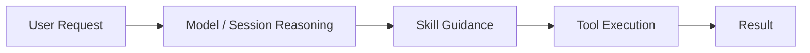

# OpenClaw Skill 触发与生效机制

这一节讲 OpenClaw 里的 `Skill` 到底是怎么被触发、加载并影响任务执行的。

## 一句话先记住

> Skill 不是模型本身，也不是工具本身，而是“在特定场景下给 agent 提供更稳定工作方法”的说明包。

---

## 1. Skill 到底是什么

Skill 可以理解成一个“面向某类任务的工作方法包”。

它通常包含：

- `SKILL.md`
- 可能附带的 `references/`
- 也可能有脚本、模板、资源文件

其中最核心的是：

- `name`
- `description`
- `SKILL.md` 正文里的流程和规则

Skill 的重点不是“增加知识点”，而是：

- 让 agent 知道这类任务应该怎么走
- 在复杂场景下减少临场乱发挥
- 把可复用经验沉淀下来

---

## 2. Skill 怎么被触发

Skill 并不是每次都全部加载。

通常流程是：

1. 系统先看到所有 skill 的基础描述（主要是 `name` 和 `description`）
2. 根据用户当前请求，判断有没有某个 skill 明显匹配
3. 如果匹配，才进一步读取那个 skill 的 `SKILL.md`
4. 如果需要更细内容，再去读 skill 里的 `references/` 文件

所以 skill 的触发本质上依赖：

- 用户当前任务是什么
- skill 的 description 写得是否清楚
- 当前场景是否明显落在这个 skill 的职责范围内

---

## 3. 为什么 description 很重要

因为在 skill 真正加载前，系统能先看到的主要就是它的元信息。

尤其是：

- skill 名字
- skill 描述（description）

description 写得越清楚，系统越容易知道：

- 这个 skill 是干什么的
- 什么情况下应该用它
- 哪些用户说法会触发它

所以 description 其实很像：

> skill 的“触发入口说明书”

---

## 4. Skill 生效后会发生什么

一旦 skill 被触发，它不会替 agent 做决定，但会强烈影响 agent 的执行方式。

它可能影响：

- 先问哪些澄清问题
- 优先走什么流程
- 遇到什么情况该切换模式
- 什么时候该读 reference
- 什么时候该调用某类工具
- 输出结果应该长什么样

所以 skill 生效后的本质是：

> agent 的工作策略被一个更专业、更稳定的流程所约束和增强。

---

## 5. Skill 和 Tool 的关系

这两个很容易一起出现，但它们不是同一种东西。

### Skill

负责：

- 决定怎么做更稳
- 给出流程和方法
- 组织某一类任务的工作策略

### Tool

负责：

- 执行具体动作
- 改文件、跑命令、抓网页、开子会话等

所以常见关系是：

- `Skill` 告诉 agent：现在应该先做什么、后做什么
- `Tool` 让 agent 真正把这些动作做出来

可以粗暴记：

- `Skill` = 方法包
- `Tool` = 动作接口

---

## 6. Skill 为什么不应该写得太胖

因为 skill 不是越长越好。

如果一个 skill 什么都往里堆，会有几个问题：

- 触发后上下文太重
- 真正关键的信息反而不突出
- 很多无关内容会干扰当前任务

所以好的 skill 设计会强调：

- 前面的 description 尽量精准
- `SKILL.md` 保持核心流程清晰
- 细节放到 `references/` 按需读取

这叫“渐进加载”或“按需展开”。

---

## 7. Skill 在 OpenClaw 里为什么重要

因为 OpenClaw 不只是让模型“会说”，而是让模型在不同工作场景里都能有更稳定的方法感。

比如：

- 教学任务可以走教学型 skill
- GitHub 操作可以走 GitHub skill
- MCP 配置可以走 mcporter skill
- 招聘网站抓取可以走专门 runbook

这意味着：

- 模型能力是通用底座
- skill 让它在具体场景里变成“更像熟手”

---

## 8. 一个完整的理解链条

你可以把 OpenClaw 里一次任务的结构理解成：

它表达的是：

- 用户提出任务
- session/模型先理解请求
- skill 提供更稳定的方法
- tool 执行动作
- 最后结果返回给用户

注意：

- skill 不是替代模型
- tool 不是替代 skill
- 三者是分层协作的

---

## 9. 这一节最该带走的理解

看完这一节，你至少应该记住：

- skill 通过 `name + description` 等元信息被识别和触发
- 触发后会影响 agent 的工作流程，但不等于直接执行动作
- tool 负责动作，skill 负责方法
- 好的 skill 要轻量、精准、按需展开

---

## 下一步

适合接着学：

- OpenClaw 的权限与安全边界
- OpenClaw 的部署与排障视角
- OpenClaw 的 Gateway / Session / Skill / Tool 如何串成完整系统
