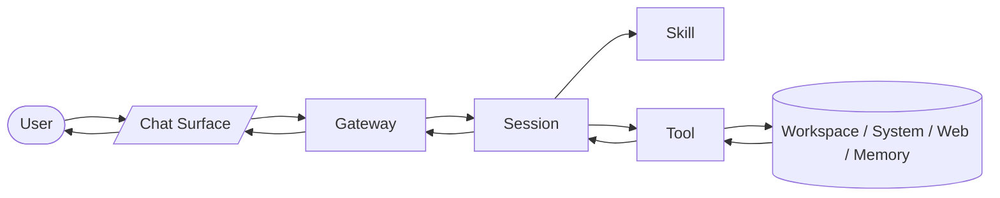

# OpenClaw 全链路串联视角

这一节把前面学过的核心概念串成一条完整链路：`Gateway -> Session -> Skill -> Tool -> Result`。

## 一句话先记住

> Gateway 负责接入与转发，Session 负责理解与调度，Skill 负责方法，Tool 负责动作，最后结果再回到用户。

如果你把这条线看明白，OpenClaw 的主体结构就真正成型了。

---

## 1. 为什么需要“串联视角”

前面我们是拆开学的：

- Gateway
- Session
- Skill
- Tool
- Memory
- Subagent / ACP

拆开学容易理解局部，但如果不串起来，就会变成“每个词都认识，合起来还是糊的”。

这一节就是把它们变成一条完整工作链。

---

## 2. 全链路总图

这张图表达的核心是：

- 用户从聊天入口发消息
- Gateway 接入并转发
- Session 决定怎么处理
- Skill 提供方法
- Tool 执行动作
- 外部结果回来后，再由 Session 组织成回复返回用户

---

## 3. Gateway：入口与转发

Gateway 的作用是：

- 接收外部消息
- 识别消息来自哪里
- 找到对应会话
- 把结果送回原渠道

所以 Gateway 更像：

- 入口层
- 路由层
- 总线层

它不是主要思考者，而是“把消息送到正确地方”。

---

## 4. Session：真正的工作核心

Session 才是实际处理任务的地方。

它会做的判断包括：

- 用户到底想要什么
- 当前上下文是什么
- 需不需要 skill
- 需不需要 tool
- 要不要查 memory
- 要不要拆 subagent / ACP

所以 Session 是：

- 决策层
- 编排层
- 当前任务上下文核心

---

## 5. Skill：给 Session 更稳的方法

Session 不会每次都裸奔处理任务。

如果某类任务有合适的 skill，session 就会按 skill 的流程来工作。

所以 skill 的作用不是替代 session，而是：

- 给 session 更专业的做事方法
- 约束流程
- 提供更稳定的处理套路

你可以把它理解成：

- Session 是人在干活
- Skill 是这个人手里的 SOP / 作战手册

---

## 6. Tool：把方法落成真实动作

只有 skill 还不够，因为方法本身不会改文件、不会执行命令。

真正落地的是 tool。

所以 tool 的位置是：

- 接在 session 后面
- 负责把判断转成真实动作
- 把结果再反馈给 session

它连接的是：

- 工作区文件
- 系统命令
- 网络资源
- 记忆数据
- 子会话体系

---

## 7. 为什么 Skill 和 Tool 要分层

因为它们解决的问题不同。

### 如果没有 Skill

系统可能还能做事，但更容易：

- 靠临场发挥
- 风格不稳定
- 不同任务缺乏专门流程

### 如果没有 Tool

系统可能能讲得很好，但很难：

- 真改文件
- 真跑命令
- 真获取系统状态
- 真把任务执行完

所以：

- Skill 解决“怎么做更稳”
- Tool 解决“怎么把它真的做出来”

---

## 8. Memory、Subagent、ACP 在这条链里怎么插入

它们不是主链本身，但会插在关键位置。

### Memory

Session 在需要长期上下文时会查 Memory。

### Subagent

Session 在任务太复杂时会拆子会话。

### ACP

Session 在需要独立 harness/runtime 时会把任务交给 ACP 会话。

所以你可以理解成：

- 主链：`Gateway -> Session -> Skill / Tool`
- 扩展件：`Memory / Subagent / ACP`

---

## 9. 最完整的一句话理解

如果把 OpenClaw 整体压成一句话：

> OpenClaw 通过 Gateway 接入请求，由 Session 在上下文中做判断，并结合 Skill 和 Tool 完成真实任务，必要时再利用 Memory、Subagent、ACP 扩展持续性与执行能力。

这句话基本就是全局总纲。

---

## 10. 这一节最该带走的理解

看完这一节，你至少应该记住：

- Gateway 是入口/转发层
- Session 是核心编排层
- Skill 提供方法
- Tool 执行动作
- Memory、Subagent、ACP 是增强系统持续性和复杂任务处理能力的扩展件

---

## 下一步

适合接着学：

- OpenClaw 部署与排障视角
- OpenClaw 全局复盘与知识压缩
