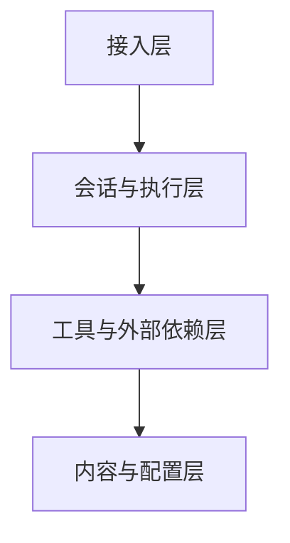

# OpenClaw 部署与排障视角

这一节从“系统真的跑起来以后”来看 OpenClaw：它怎么部署、常见问题在哪、排障时应该先看哪里。

## 一句话先记住

> 学会 OpenClaw，不只是会讲架构，还要知道它作为一个运行中的系统，出问题时该先查哪一层。

---

## 1. 为什么需要部署与排障视角

前面我们学的是逻辑结构：

- Gateway
- Session
- Skill
- Tool
- Memory
- Subagent / ACP

但真实使用时，问题往往不是“概念不懂”，而是：

- 为什么消息没进来
- 为什么 session 没响应
- 为什么 tool 没跑通
- 为什么 wiki 没推成功
- 为什么 node / device 连不上

所以部署与排障视角，本质上是在问：

> 当 OpenClaw 真正在机器上跑时，哪一层坏了，我该怎么判断？

---

## 2. 可以把排障分成 4 层

### 接入层

关注：

- Gateway 是否正常
- 聊天渠道是否连通
- 消息有没有成功进入系统

### 会话与执行层

关注：

- Session 是否创建/恢复成功
- agent 是否真的在处理
- 子会话 / ACP 是否正常拉起

### 工具与外部依赖层

关注：

- shell 命令是否正常
- GitHub / 网络 / MCP 等是否连通
- 外部服务是否认证成功

### 内容与配置层

关注：

- skill 写得对不对
- wiki / 仓库配置是否正确
- memory / 文档 / 本地文件是否符合预期

---

## 3. 最常见的故障分类

### A. 消息进不来

症状：

- 用户发了消息，系统没反应
- 平台侧看着正常，但 agent 没收到

优先检查：

- Gateway 状态
- 渠道接入是否正常
- 相关服务是否在运行

### B. 收到消息但不执行

症状：

- 有会话，但没有真正干活
- 回复卡住、很慢、或没后续动作

优先检查：

- Session 是否正常
- 当前模型/runtime 是否工作正常
- 是否卡在某个工具调用上

### C. Tool 调不动

症状：

- 文件读不到
- 命令跑不通
- 外网抓取失败
- GitHub push 失败

优先检查：

- 工具权限
- 系统环境
- 网络连通性
- 外部认证（token / gh / MCP）

### D. 结果不符合预期

症状：

- skill 没触发
- 文档结构不对
- 回答风格跑偏
- 应该查 memory 却没查

优先检查：

- skill description 是否能触发
- SKILL.md 流程是否清晰
- 当前任务是否真的命中这个 skill

---

## 4. 一个实用排障顺序

如果你以后自己排障，可以先按这个顺序：

1. **先看入口**：消息有没有进来
2. **再看会话**：session 有没有起来
3. **再看工具**：tool 有没有成功执行
4. **再看外部依赖**：GitHub/MCP/网络/系统环境是否正常
5. **最后看 skill/配置**：是不是流程逻辑或配置写错了

这个顺序的好处是：

- 先排最外层
- 再排中间执行层
- 最后排内容与逻辑层

不容易一上来就陷进细节里。

---

## 5. 为什么说排障不能只盯模型

很多人一出问题会先怀疑模型，其实不一定。

因为 OpenClaw 是一个系统，不只是模型调用。

问题可能出在：

- Gateway 没收到消息
- Session 没创建成功
- Tool 超时
- GitHub 凭证失效
- MCP 配置不通
- skill 没触发

所以：

- 模型只是系统里的一个部分
- 排障时要有“系统分层”意识

---

## 6. 一个最短的系统化理解

你可以把部署与排障压成一句话：

> OpenClaw 出问题时，要先判断是入口、会话、工具/依赖、还是配置/内容层出了问题，而不是一股脑怀疑模型。

---

## 7. 这一节最该带走的理解

看完这一节，你至少应该记住：

- OpenClaw 的问题通常可以按层来拆
- 排障顺序比死记命令更重要
- 模型不是唯一故障点
- 真实系统里，Gateway、Session、Tool、依赖、配置都可能出问题

---

## 下一步

最后一节适合学：

- OpenClaw 全局复盘与知识压缩
