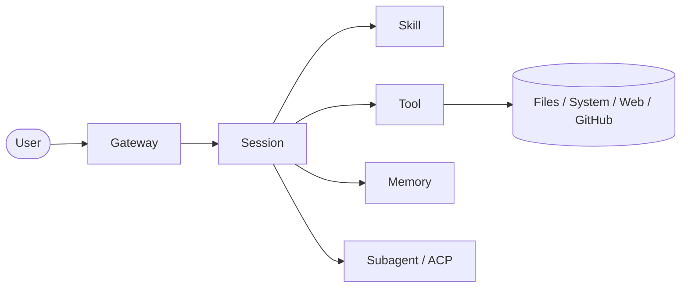

# OpenClaw Final Review

这是 OpenClaw 学习路线的最后一章，用来把前面所有内容压缩成一套能真正带走的知识地图。

## 一句话总纲

> OpenClaw 不是普通聊天机器人，而是一套让 AI 能接入消息、组织上下文、调用方法、使用工具、保存记忆、拆分任务并持续执行的 agent 系统。

如果你只记这一句，已经抓住了主体。

---

## 1. 最小知识骨架

学完整个 OpenClaw，最少要记住这条主链：

```text
Gateway -> Session -> Skill -> Tool -> Result
```

它对应的含义是：

- `Gateway`：接入和转发
- `Session`：理解和编排
- `Skill`：方法和流程
- `Tool`：真实动作
- `Result`：最终反馈给用户

这是 OpenClaw 的最小工作闭环。

---

## 2. 四句话压缩核心组件

### Gateway

负责把消息接进系统，再把结果送回原渠道。

### Session

负责在上下文里判断任务、组织动作、串联流程。

### Skill

负责让某类任务有更稳定的方法感，而不是全靠临场发挥。

### Tool

负责真正执行动作，让 agent 不只是会说，而是会做。

---

## 3. 三个增强件

主链之外，还有三个你必须知道的增强件：

### Memory

让系统跨会话保留重要信息。

### Subagent

让复杂任务可以拆出去独立处理。

### ACP

让任务可以交给独立 harness / 独立 runtime 持续执行。

所以可以再压一句：

> 主链负责完成一次任务，增强件负责让系统更持久、更复杂、更像真正的 agent。

---

## 4. Skill、Tool、模型三者怎么区分

这是最容易混淆但最重要的一组。

### 模型

负责理解语言、推理、规划、表达。

### Skill

负责把“怎么做更稳”固化成流程。

### Tool

负责把动作真正执行出来。

所以最短记忆法：

- 模型：想
- Skill：怎么做
- Tool：真去做

---

## 5. 为什么 OpenClaw 不是普通聊天机器人

因为它不是：

- 收到消息
- 模型直接吐字
- 结束

而是：

- 收到消息
- 恢复会话上下文
- 判断是否需要 skill
- 判断是否需要 tool
- 必要时查 memory
- 必要时拆 subagent / ACP
- 真正完成任务后再返回结果

所以它更像：

> 一个任务处理系统 + agent 运行框架

而不是纯聊天壳。

---

## 6. 排障时的系统观

你现在也应该知道，OpenClaw 出问题时不能只盯模型。

因为问题可能在：

- 入口层（Gateway / 消息接入）
- 会话层（Session / runtime）
- 工具层（Tool / 外部依赖）
- 配置层（Skill / 配置 / 内容）

所以排障核心不是背命令，而是会分层看系统。

---

## 7. 最终压缩版知识地图



这张图已经能代表你对 OpenClaw 的整体理解了。

---

## 8. 学完整套后你应该能做到什么

如果这 10 节你都吃透了，你至少应该能：

- 讲清 OpenClaw 的核心架构
- 区分 Gateway、Session、Skill、Tool 的职责
- 讲清 Memory、Subagent、ACP 的价值
- 理解 Skill 触发机制
- 理解 Tool 为什么是执行层
- 理解安全边界为什么重要
- 有基本的部署与排障思路

这时你就不再只是“知道几个词”，而是真的有系统图了。

---

## 9. 最终一句话总结

> OpenClaw 是一套以 Session 为核心、以 Skill 为方法、以 Tool 为执行、并由 Memory / Subagent / ACP 扩展持续性和复杂任务能力的 agent 运行系统。

这句话可以当你的最终口袋版总结。
