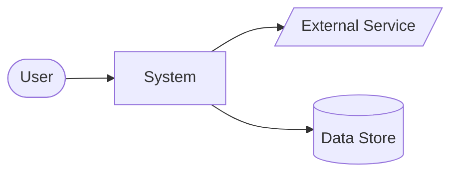
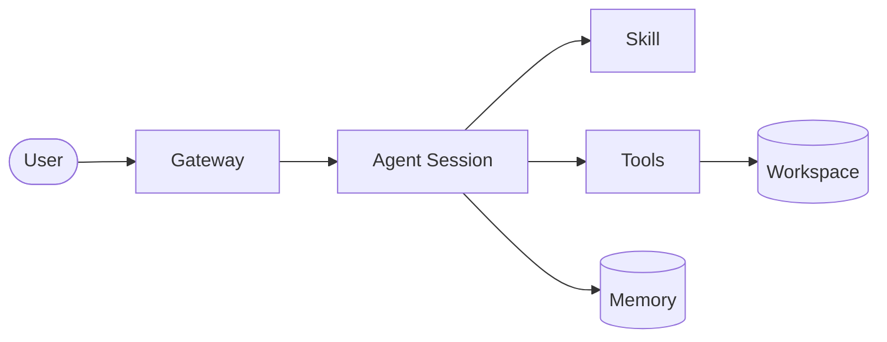
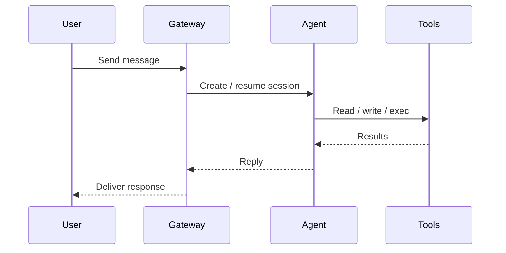
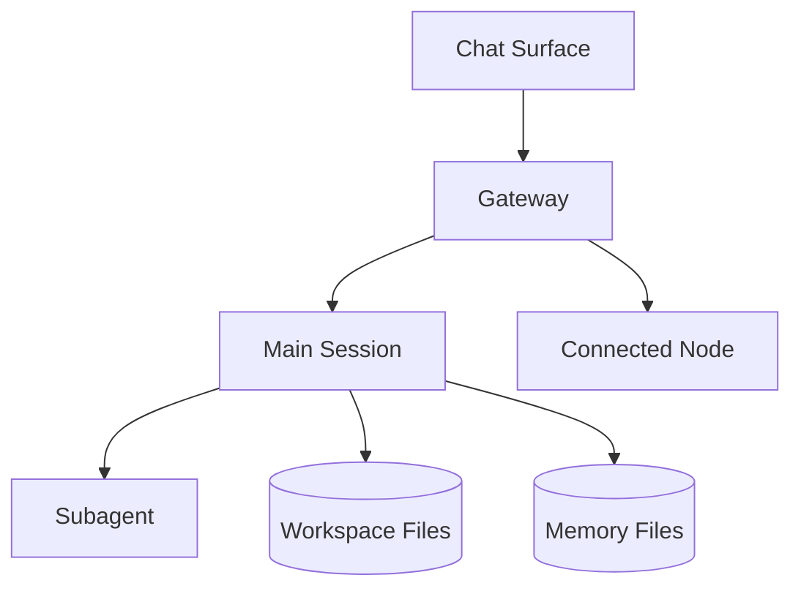
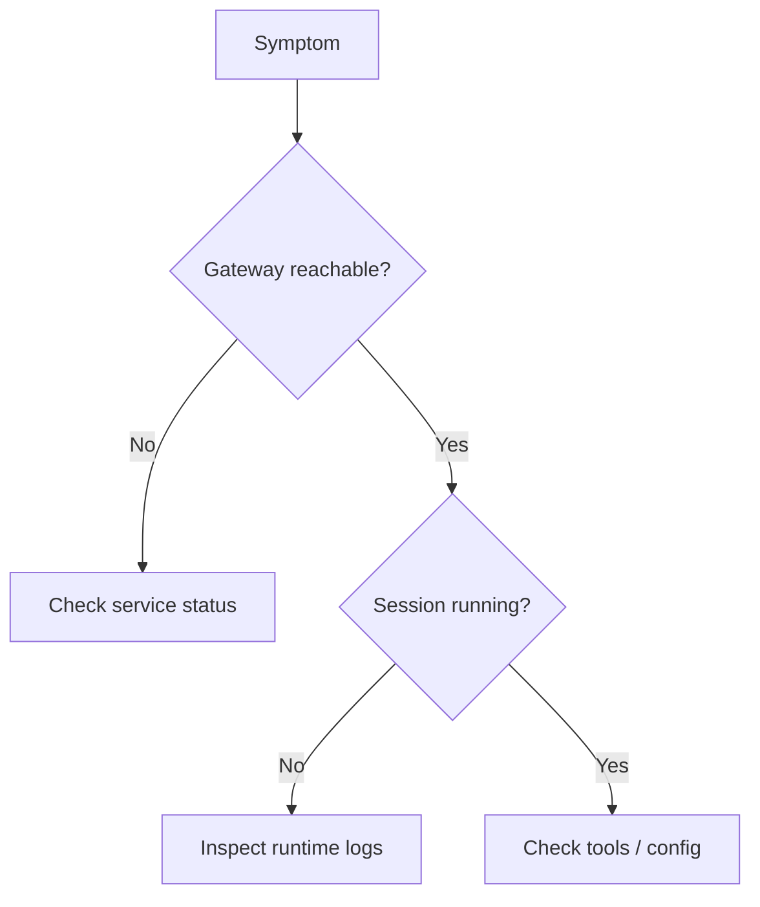

# Mermaid Patterns

Use these templates to generate diagrams quickly.

## Pattern A: System Context



## Pattern B: Container View



## Pattern C: Request Flow



## Pattern D: Deployment View



## Pattern E: Troubleshooting Flow



## Quality Checks

Before finalizing a diagram, verify:
- node names are human-readable
- arrows have a clear meaning
- the diagram matches the user's question
- there are not too many components for one picture
- the diagram could be explained in under one minute
```